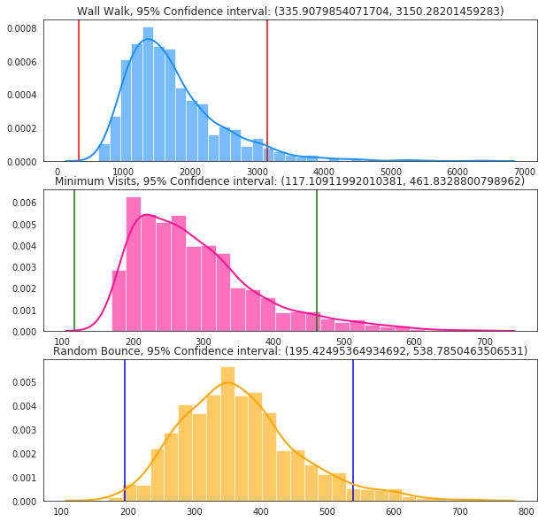
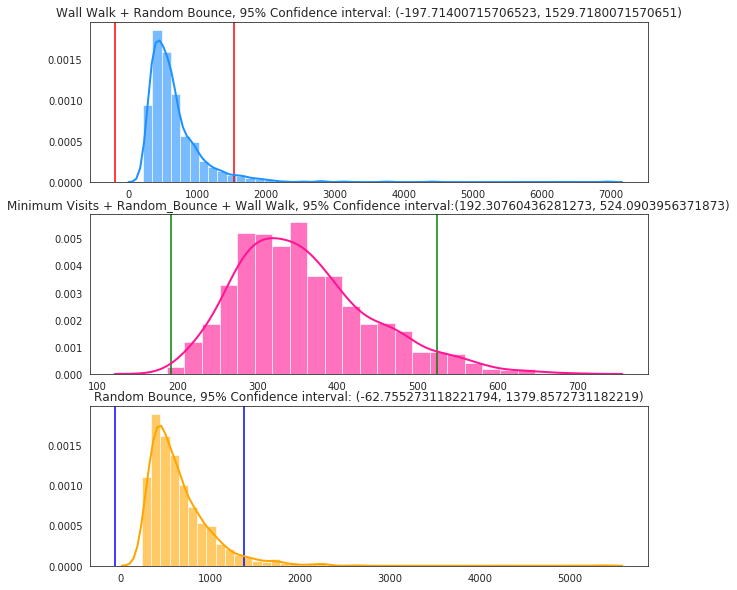
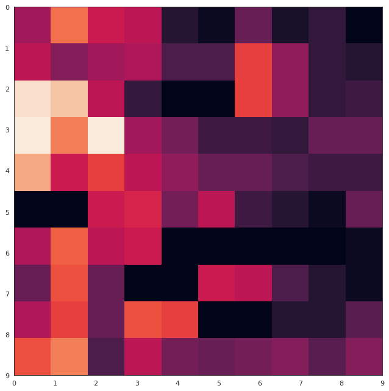
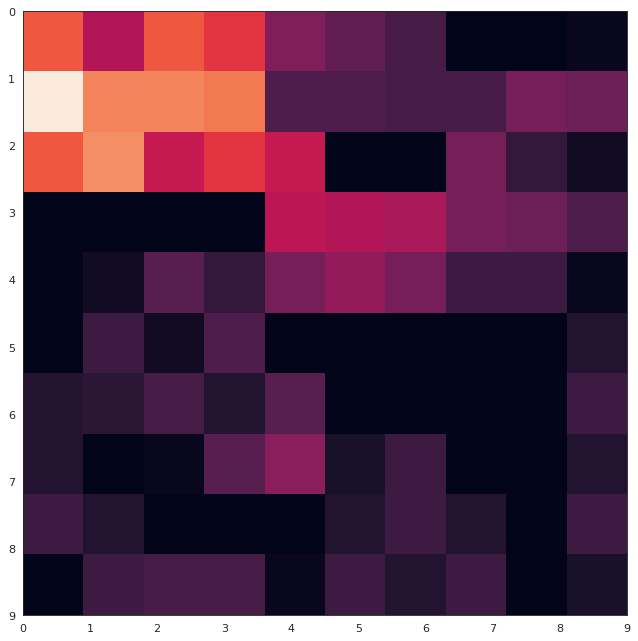
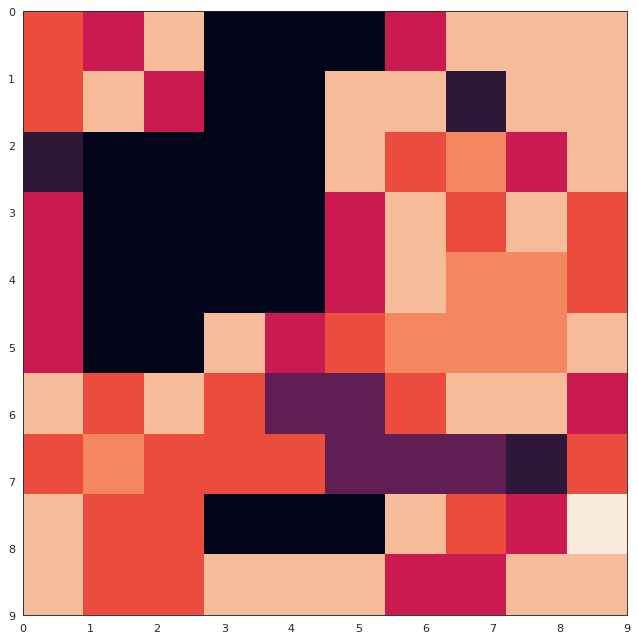
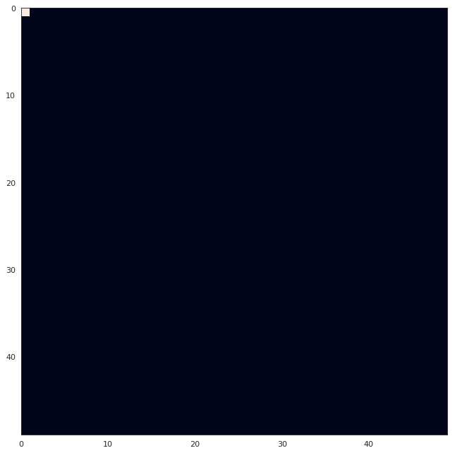
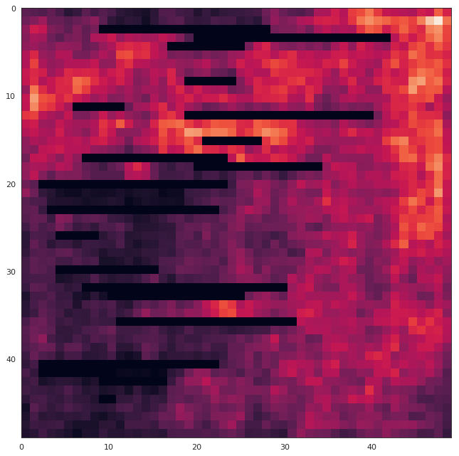
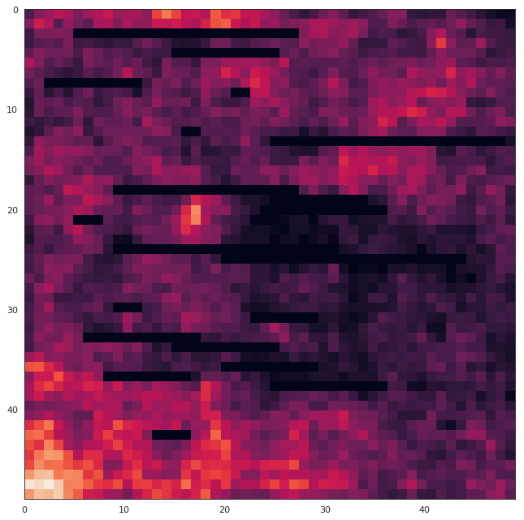

Import all necessary Packages


```python
import random
from IPython.display import clear_output
import time
from scipy import array, newaxis
import numpy as np
import matplotlib.pyplot as plt
from matplotlib.pyplot import figure
from scipy.interpolate import interp2d

```

Initiate the character map, specify the tile class and house class.


```python

character_map = {0:"👍",1:"👎",2:"💩",'W':"💀", 'bot':"🤖"}

class tile():
  def __init__(self, position, cleanliness=0, wall = False, bot = False):
    #Capture the directions to the left, right, bottom and top as per Von Neumann neighbourhoods.
    #Capture the cleanliness, positions and also markers for visits and if the bot is on the cell
    self.position = position
    self.cleanliness = cleanliness
    self.right = (position[0],position[1]+1)
    self.left = (position[0],position[1]-1)
    self.bottom = (position[0]+1,position[1])
    self.top = (position[0]-1,position[1])
    self.bot = False
    self.visit = 0
    
  
class house_c(tile): 
  def __init__(self, obstacles = 5, dimensions = (15,15), mess = "Very Dirty"):
    self.dimensions = dimensions
    self.house = house = [[0]*dimensions[1] for row in range(dimensions[0])]
    self.walls = 3
    self.obstacles = obstacles
    self.mess = mess
  
  def add_walls(self):
    #To keep things simple, we just add walls on horizontal walls with at most half the room length
    half_length = self.dimensions[1]//2
    #generate 3 random walls that dont coincide with the house walls so betweeen dimension-1, non inclusive
    wall_rows = random.sample(range(2, self.dimensions[1]-1),min(self.obstacles, half_length))
    for row in wall_rows:
      #Spawn a wall of randomlength between 1 and half_length. We limit walls to a minimum 2 length
      wall_length = random.randint(2, half_length)
      #Starting position for the wall. It must be before the midroom so any wall fits
      start_pos = random.randint(0, self.dimensions[1]//2)
      for tile in range(start_pos, start_pos+wall_length):
        self.house[row][tile].wall = True
        self.house[row][tile].cleanliness = "W"
    return None    
  
 
  #This function spawns a house. By defaultm the house cleanliness is dirty in case the option selected is wrong.
  #We populate the tiles with a cleanliness leve as specified by the use.
  def spawn_house(self):
    clean = 2
    for row in range(self.dimensions[1]):
      for cell in range(self.dimensions[0]):
        #Make the house messy
        if self.mess == "Very Dirty":
          pass
        elif self.mess == "Random":
          clean = random.randint(0,2)
        elif self.mess == "Slightly Clean":
          clean = 1
        elif self.mess == "Clean":
          clean = 0
        self.house[cell][row] = tile(position = (cell, row), cleanliness = clean)
    self.add_walls()
    return self.house
  
  #A string method to output the house as per the character map.
  def __str__(self):
    full = []
    for row in self.house:
      cur_row = []
      for tile in row:
        if not tile.bot:
          cur_row.append(character_map[tile.cleanliness])
        else:
          cur_row.append(character_map["bot"])
      full.append("".join(cur_row))
    print("########## WELCOME TO MY HOUSE! ###########")
    print(f"It is {self.mess}")
    print("And be careful, the walls have ears, literally.\n")
    return "\n".join(full)
    
  

 
```

This is an initialization of the roomba class. It needs to know the house it is serving. Some utility functions are included to help when programming the bot.


```python
class roomba():
  #Initiate the roomba bot. 
  #Markers for the strategies like random bounce and wall walking are specified.
  def __init__(self, house, wall_walking = True, random_bounce = True, start = (0,0), delay =1,minimum_visits = True):
    self.wall_walking = wall_walking
    self.random_bounce = random_bounce
    self.start = start
    self.house = house
    self.movement = {"Right":(0,1), "Left":(0, -1), "Top":(-1, 0), "Bottom":(1, 0), "Current":(0,0)}
    self.direction = None
    self.delay = delay
    self.minimum_visits = minimum_visits
    self.count_steps = 0
  """
  -This utility function determines the level of cleanliness of the house. 
  -A roomba user can determine this then program the roomba to run tiil it feels it
  -has collected as much dirt to leave the room in a cleanliness proportion specified.
  """
  def check_clean(self):
    dirt = 0
    for row in self.house.house:
      for tile in row:
        if tile.cleanliness !="W":
          try:
            dirt+=int(tile.cleanliness)
          except:
            pass
    return dirt
  """  
  -This utility function gets the roomba position and tells it where it can go. 
  -Depending on activated strategies, it can favor wall crawling or random bouncing or both. 
  -The situations are discussed in tha paper/
  """
  def possible_directions(self, bot_position):
    feasible = {"Current":bot_position}
    neighbor_clean = {"Current":self.house.house[bot_position[0]][bot_position[1]].cleanliness}
    direction = None
    #There are only 4 possible directions
    direction_keys = list(self.movement.keys())
    
    for direction in direction_keys:
      next_row = bot_position[0]+self.movement[direction][0]
      next_col = bot_position[1]+self.movement[direction][1]
      """
      -If the tiles are outside the house span, we will skip them
      -Nonetheless, these are our wall markers so we might want to keep track of the wally neighbors so as to follow them
      """
      if next_row <0 or next_col <0 or  next_row >=self.house.dimensions[0] or next_col>=self.house.dimensions[1]:
        continue
      
      else:
        """
        -If the tiles are withn the span are walls, we will skip them, otherwise we can move to them
        -We move at random whether the floor is clean or not but focus will force us to sty if a tile is too dirty
        """
        next_tile_cleanliness = self.house.house[next_row][next_col].cleanliness
        
        if next_tile_cleanliness is not "W":
          feasible[direction] = (next_row, next_col)
          neighbor_clean[direction] = self.house.house[next_row][next_col].cleanliness
          
    #For efficiency, if there are any neighbors dirty, we will not visit clean neighbors again thus prioritizing dirty spots
    if sum(list(neighbor_clean.values()))>0:
      #Random bounce tells the system to jump to a random dirty cell if any. Otherwise move in a random direction
      if self.random_bounce:
        for direction in list(feasible.keys()):
          if neighbor_clean[direction] == 0:
            del feasible[direction]
      
      #Atop the clean elimination, if wall following is enabled, we will favor the wall direction if no dirty tile is seen.
      priority = []
      """
      -Under the same constraint, if wall walkingis enabled, we basicallt prioritize the directions
      -That walk the wall in the feasible set and eliminate the others.
      -Affinity for dirty preceeds the wall walk either way so if we encounter a dirty cell not on the wall
      -and a cleaner one ahead, we will stop the wall walk. This is if
      """
      if self.wall_walking:
        if len(feasible)>1:
          for direction in list(feasible.keys()):
            next_row = bot_position[0]+self.movement[direction][0]
            next_col = bot_position[1]+self.movement[direction][1]
            if direction =="Top" or direction == "Bottom":
              if bot_position[1]+1>=self.house.dimensions[1] or bot_position[1]-1<0 or self.house.house[bot_position[0]][bot_position[1]+1].cleanliness == 'W' or self.house.house[bot_position[0]][bot_position[1]-1].cleanliness == 'W':
                priority.append(direction)
            
            elif direction == "Right" or direction == "Left":
              if bot_position[0]+1>=self.house.dimensions[0] or  bot_position[0]-1<0 or self.house.house[bot_position[0]+1][bot_position[1]].cleanliness=="W" or self.house.house[bot_position[0]-1][bot_position[1]].cleanliness=="W":
                priority.append(direction)
        
      """
      -A check to ensure we limit our options to sensible ones. 
      -The bot behaves randomly when in a clean room since the sum of neighbors cleanlines is 0
      -This means they have no dirtiness.  
      """
      if len(priority)<len(feasible) and len(priority)>0:
        for direction in list(feasible.keys()):
          if direction in priority:
            continue
          else:
            del feasible[direction]
    return (feasible, neighbor_clean)
  
  #A utility function to produce a heatmap.
  def heatmap(self):
      x_list = [x for x in range(self.house.dimensions[1])]
      y_list = [y for y in range(self.house.dimensions[0])]
      z_list = []
      for ys in y_list:
        for xs in x_list:
          z_list.append(house1.house[xs][ys].visit)

      
      f = interp2d(x_list,y_list,z_list,kind="linear")

      x_coords = np.arange(min(x_list),max(x_list)+1)
      y_coords = np.arange(min(y_list),max(y_list)+1)
      Z = f(x_coords,y_coords)
      figure(num=None, figsize=(10, 10), dpi=80, facecolor='w', edgecolor='k')
      fig = plt.imshow(Z,
                 extent=[min(x_list),max(x_list),min(y_list),max(y_list)],
                 origin="lower")

      fig.axes.set_autoscale_on(False)
      plt.scatter(x_list,y_list,400,facecolors='none')
      plt.gca().invert_yaxis()
      plt.show()
  
  """
  This function initiates the movement.
  -Parameters such as focus tell us if we stick to a dirty cell untill it is clean.
  -Clean level is the goal state of how clean we want our house. This gives the bot 
  -an idea of how much cleaning it will have done till it stops.
  -Blink is for when we want an animated version of the bot in action.
  -Out_steps is the steps moved before we show the state currently we are in.
  -Have a high out_step for big houses to limit the output. 
  """
  def initiate_traversal(self, focus,fin, clean_level, blink =True, heatmap = True, out_steps=20):
    #Check how clean the house is
    dirt = self.check_clean()
    original = dirt
    target_clean = dirt*clean_level
    count_steps = 0
    #Run till we feel we have collected enough dirt to make the room clean to desired levels.
    while target_clean<dirt:
      proportion_cleaned = dirt/original
      #Get the current bot tile as is
      bot_tile = self.house.house[self.start[0]][self.start[1]]
      #Put the bot in starting tile
      self.house.house[self.start[0]][self.start[1]].bot = True
      self.house.house[self.start[0]][self.start[1]].visit +=1
      next_data = self.possible_directions(bot_tile.position)
      possible_directions = next_data[0]
      
      """
      -Minimum visits is my proposed third setting.This tells the bot to favor visiting cells it
      -Has not visited yet. It especially helps prevent sticking too much in a clean patch.
      -If the bot stays in a place for too long, it eventually favors moving away as it detects this.
      """
      if self.minimum_visits:
        min_vals = list(possible_directions.values())[0]
        min_vis = self.house.house[min_vals[0]][min_vals[1]].visit
        for direc in list(possible_directions.keys()):
          cur_vis = self.house.house[possible_directions[direc][0]][possible_directions[direc][1]].visit
          if cur_vis<=min_vis:
            direction = direc
            min_vis = cur_vis
      else:
        #Otherwise, we will move in a random direction
        direction = random.choice(list(possible_directions.keys()))
      if focus:
        #Focus is for when we want to clean any dirty patch to completion
        if self.house.house[self.start[0]][self.start[1]].cleanliness >0:
          direction = "Current"
          self.house.house[self.start[0]][self.start[1]].visit +=2
          
      else:
        del possible_directions["Current"]
      
        
      #Clean bot tile then move bot in direction specified
      self.house.house[self.start[0]][self.start[1]].cleanliness = max((int(bot_tile.cleanliness)-1),0)
      #Blink check
      if blink:
        clear_output()
      
      #Output checks
      if count_steps%out_steps == 0 or proportion_cleaned==0:  
        if fin:
            print(f"Proportion Remaining = {proportion_cleaned}")
            print(f"Possible directions: {possible_directions}")
            print(self.house)
      
      #Heatmap checks
      if heatmap and count_steps%out_steps == 0 or proportion_cleaned==0:
        self.heatmap()
        print(f"\nNext step direction: {direction}")
      self.house.house[self.start[0]][self.start[1]].bot = False
      self.start = (self.start[0]+self.movement[direction][0], self.start[1]+self.movement[direction][1])
      #A delay that facilitates the blink system
      if blink and count_steps%out_steps == 0 or proportion_cleaned==0:
        time.sleep(self.delay)
      dirt =  self.check_clean()
      count_steps+=1
    self.count_steps = count_steps
  
    
    
    
    
  #Our parent function that initiates the cleaning and tells us the final state.
  def clean(self,clean_level, focus,blink =True, heatmap = True, out_steps=20, fin = True):    
      self.initiate_traversal(focus = focus, clean_level = clean_level, blink =blink, heatmap = heatmap,  out_steps=out_steps, fin=fin)
      if fin:
          print("FINAL STATE OF THE HOUSE")
          print(f"Moves made: {self.count_steps}")
          print(self.house)
          self.heatmap()
      return self.count_steps
      
```

Test Individual Strategies performance


```python
random_bounce = []
wall_walk = []
minimum_visit = []
#Each house will have Its own instance since this is modified during cleaning.
copy1 =  house_c(obstacles = 1, mess = "Random", dimensions  =(10, 10))
copy2 =  house_c(obstacles = 1, mess = "Random", dimensions  =(10, 10))
copy3 =  house_c(obstacles = 1, mess = "Random", dimensions  =(10, 10))
    
for i in range(1000):
    #Spawn a house
    copy1.spawn_house()
    copy2.spawn_house()
    copy3.spawn_house()
    
    #Initiate the roombas
    roombaRB = roomba(house = copy1, delay = 1, start = (0,0),wall_walking =False, 
                 random_bounce = True, minimum_visits = True)
    roombaWW = roomba(house = copy2, delay = 1, start = (0,0),wall_walking =True, 
                 random_bounce = False, minimum_visits = False)
    roombaMV = roomba(house = copy3, delay = 1, start = (0,0),wall_walking =False, 
                 random_bounce = False, minimum_visits = True)
    
    #And lets dance!!!
    rb = roombaRB.clean(clean_level=0, focus =True, blink =False, heatmap = False, out_steps=10000000, fin=False)
    ww = roombaWW.clean(clean_level=0, focus =True, blink =False, heatmap = False, out_steps=10000000, fin=False)
    mv = roombaMV.clean(clean_level=0, focus =True, blink =False, heatmap = False, out_steps=10000000, fin=False)
    
    random_bounce.append(rb)
    wall_walk.append(ww)
    minimum_visit.append(mv)

```


```python
import numpy as np, scipy.stats as stats
import seaborn as sns

def mean_confidence_interval(data, confidence=0.95):
    data = np.array(data)
    return stats.norm.interval(confidence, loc=np.mean(data), scale=np.std(data))

confints_rb = mean_confidence_interval(np.array(random_bounce))
confints_ww = mean_confidence_interval(wall_walk)
confints_mv = mean_confidence_interval(minimum_visit)

sns.set_style("white")

kwargs = dict(hist_kws={'alpha':.6}, kde_kws={'linewidth':2})

fig = plt.figure()
fig.set_size_inches(10, 10)
ax1 = fig.add_subplot(311)
ax1.axvline(x=confints_ww[0], color = "r")
ax1.axvline(x=confints_ww[1], color = "r")
sns.distplot(wall_walk, color="dodgerblue", label="Wall Walk", **kwargs)
ax1.set_title(f"Wall Walk, 95% Confidence interval: {(confints_ww[0], confints_ww[1])}")
ax2 = fig.add_subplot(312)
ax2.axvline(x=confints_mv[0], color = "g")
ax2.axvline(x=confints_mv[1], color = "g")
sns.distplot(minimum_visit, color="deeppink", label="Minimum Visits", **kwargs)
ax2.set_title(f"Minimum Visits, 95% Confidence interval: {(confints_mv[0], confints_mv[1])}")

ax3 = fig.add_subplot(313)
ax3.axvline(x=confints_rb[0], color = "b")
ax3.axvline(x=confints_rb[1], color = "b")
sns.distplot(random_bounce, color="orange", label="Random Bounce", **kwargs)
ax3.set_title(f"Random Bounce, 95% Confidence interval: {(confints_rb[0], confints_rb[1])}")

plt.show()
```





For our original simulations, these are the histograms


```python
rb = []
ww_rb = []
mv_rb_ww = []

for i in range(1000):   
    #Spawn a house
    copy1.spawn_house()
    copy2.spawn_house()
    copy3.spawn_house()
    
    #Initiate the roombas
    roombaRB = roomba(house = copy1, delay = 1, start = (0,0),wall_walking =False, 
                 random_bounce = True, minimum_visits = False)
    roombaWWRB = roomba(house = copy2, delay = 1, start = (0,0),wall_walking =True, 
                 random_bounce = True, minimum_visits = False)
    roombaMVRBWW = roomba(house = copy3, delay = 1, start = (0,0),wall_walking =True, 
                 random_bounce = True, minimum_visits = True)
    
    #And lets dance!!!
    rbi = roombaRB.clean(clean_level=0, focus =True, blink =False, heatmap = False, out_steps=10000000, fin=False)
    ww_rbi = roombaWWRB.clean(clean_level=0, focus =True, blink =False, heatmap = False, out_steps=10000000, fin=False)
    mv_rb_wwi = roombaMVRBWW.clean(clean_level=0, focus =True, blink =False, heatmap = False, out_steps=10000000, fin=False)
    
    rb.append(rbi)
    ww_rb.append(ww_rbi)
    mv_rb_ww.append(mv_rb_wwi)

```


```python
confints_rb = mean_confidence_interval(np.array(rb))
confints_ww = mean_confidence_interval(ww_rb)
confints_mv = mean_confidence_interval(mv_rb_ww)

sns.set_style("white")

kwargs = dict(hist_kws={'alpha':.6}, kde_kws={'linewidth':2})

fig = plt.figure()
fig.set_size_inches(10, 10)
ax1 = fig.add_subplot(311)
ax1.axvline(x=confints_ww[0], color = "r")
ax1.axvline(x=confints_ww[1], color = "r")
sns.distplot(ww_rb, color="dodgerblue", label="Wall Walk", **kwargs)
ax1.set_title(f"Wall Walk + Random Bounce, 95% Confidence interval: {(confints_ww[0], confints_ww[1])}")
ax2 = fig.add_subplot(312)
ax2.axvline(x=confints_mv[0], color = "g")
ax2.axvline(x=confints_mv[1], color = "g")
sns.distplot(mv_rb_ww, color="deeppink", label="Minimum Visits", **kwargs)
ax2.set_title(f"Minimum Visits + Random_Bounce + Wall Walk, 95% Confidence interval:{(confints_mv[0], confints_mv[1])}")

ax3 = fig.add_subplot(313)
ax3.axvline(x=confints_rb[0], color = "b")
ax3.axvline(x=confints_rb[1], color = "b")
sns.distplot(rb, color="orange", label="Random Bounce", **kwargs)
ax3.set_title(f"Random Bounce, 95% Confidence interval: {(confints_rb[0], confints_rb[1])}")

plt.show()
```





Demonstrations.

1. No minimized visits, no wall walking, just random bounce


```python
house1 = house_c(obstacles = 5, mess = "Random", dimensions  =(10, 10)) 
house1.spawn_house()


roomba1 = roomba(house = house1, delay = 1, start = (0,0),wall_walking =False, 
                 random_bounce = True, minimum_visits = False)
roomba1.clean(clean_level=0, focus =True, blink =True, heatmap = True, out_steps=1)
```

    Proportion Remaining = 0.011764705882352941
    Possible directions: {'Current': (1, 9)}
    ########## WELCOME TO MY HOUSE! ###########
    It is Random
    And be careful, the walls have ears, literally.
    
    👍👍👍👍👍👍👍👍👍👍
    👍👍👍👍👍👍👍👍👍🤖
    👍👍👍👍💀💀👍👍👍👍
    👍👍👍👍👍👍👍👍👍👍
    👍👍👍👍👍👍👍👍👍👍
    💀💀👍👍👍👍👍👍👍👍
    👍👍👍👍💀💀💀💀💀👍
    👍👍👍💀💀👍👍👍👍👍
    👍👍👍👍👍💀💀👍👍👍
    👍👍👍👍👍👍👍👍👍👍





    
    Next step direction: Current
    FINAL STATE OF THE HOUSE
    Moves made: 778
    ########## WELCOME TO MY HOUSE! ###########
    It is Random
    And be careful, the walls have ears, literally.
    
    👍👍👍👍👍👍👍👍👍👍
    👍👍👍👍👍👍👍👍👍👍
    👍👍👍👍💀💀👍👍👍👍
    👍👍👍👍👍👍👍👍👍👍
    👍👍👍👍👍👍👍👍👍👍
    💀💀👍👍👍👍👍👍👍👍
    👍👍👍👍💀💀💀💀💀👍
    👍👍👍💀💀👍👍👍👍👍
    👍👍👍👍👍💀💀👍👍👍
    👍👍👍👍👍👍👍👍👍👍


    778


```python
house1 = house_c(obstacles = 5, mess = "Random", dimensions  =(10, 10)) 
house1.spawn_house()


roomba1 = roomba(house = house1, delay = 1, start = (0,0),wall_walking =True, 
                 random_bounce = True, minimum_visits = False)
roomba1.clean(clean_level=0, focus =True, blink =True, heatmap = True, out_steps=1)
```

    Proportion Remaining = 0.011627906976744186
    Possible directions: {'Current': (9, 9)}
    ########## WELCOME TO MY HOUSE! ###########
    It is Random
    And be careful, the walls have ears, literally.
    
    👍👍👍👍👍👍👍👍👍👍
    👍👍👍👍👍👍👍👍👍👍
    👍👍👍👍👍💀💀👍👍👍
    💀💀💀💀👍👍👍👍👍👍
    👍👍👍👍👍👍👍👍👍👍
    👍👍👍👍💀💀💀💀💀👍
    👍👍👍👍👍💀💀💀💀👍
    👍👍👍👍👍👍👍👍👍👍
    👍👍💀💀💀👍👍👍👍👍
    👍👍👍👍👍👍👍👍👍🤖





    
    Next step direction: Current
    FINAL STATE OF THE HOUSE
    Moves made: 656
    ########## WELCOME TO MY HOUSE! ###########
    It is Random
    And be careful, the walls have ears, literally.
    
    👍👍👍👍👍👍👍👍👍👍
    👍👍👍👍👍👍👍👍👍👍
    👍👍👍👍👍💀💀👍👍👍
    💀💀💀💀👍👍👍👍👍👍
    👍👍👍👍👍👍👍👍👍👍
    👍👍👍👍💀💀💀💀💀👍
    👍👍👍👍👍💀💀💀💀👍
    👍👍👍👍👍👍👍👍👍👍
    👍👍💀💀💀👍👍👍👍👍
    👍👍👍👍👍👍👍👍👍👍


    656


```python
house1 = house_c(obstacles = 5, mess = "Random", dimensions  =(10, 10)) 
house1.spawn_house()


roomba1 = roomba(house = house1, delay = 1, start = (0,0),wall_walking =True, 
                 random_bounce = True, minimum_visits = True)
roomba1.clean(clean_level=0, focus =True, blink =True, heatmap = True, out_steps=1)
```

    Proportion Remaining = 0.05555555555555555
    Possible directions: {'Current': (4, 5), 'Right': (4, 6), 'Top': (3, 5), 'Bottom': (5, 5)}
    ########## WELCOME TO MY HOUSE! ###########
    It is Random
    And be careful, the walls have ears, literally.
    
    👍👍👍👍👎👍👍👍👍👍
    👍👍👍👍👍👍👍👍👍👍
    👍💀💀💀💩👍👍👍👍👍
    👍👍💀💀💀👍👍👍👍👍
    👍💩💀💀💀🤖👍👍👍👍
    👍💀💀👍👍👍👍👍👍👍
    👍👍👍👍👍👍👍👍👍👍
    👍👍👍👍👍👍👍👍👍👍
    👍👍👍💀💀💀👍👍👍👍
    👍👍👍👍👍👍👍👍👍👍





    
    Next step direction: Top


For coverage

**Only Random Bounce**


```python
house1 = house_c(obstacles = 20, mess = "Random", dimensions  =(50, 50)) 
house1.spawn_house()


roomba1 = roomba(house = house1, delay = 1, start = (0,0),wall_walking =False, 
                 random_bounce = True, minimum_visits = False)
roomba1.clean(clean_level=0, focus =True, blink =False, heatmap = True, out_steps=1000000000)
```

    Proportion Remaining = 1.0
    Possible directions: {'Right': (0, 1), 'Bottom': (1, 0)}
    ########## WELCOME TO MY HOUSE! ###########
    It is Random
    And be careful, the walls have ears, literally.
    
    🤖👎💩👎👍👍👍💩👍💩👍👎👎👎💩💩💩💩👎💩👍💩👍👎👍💩👎💩👎💩👍💩👍👍👎👎👍👍💩💩👎👎💩👍💩👎👍💩👍👎
    💩👍💩👎💩👎👍👎💩👎👍👍👎👍👎👎💩👎💩👍👎👍💩👍💩👎💩👍👎👎👎👎👎💩👎👍💩👎💩💩👍👍👎👍💩👍💩💩👎👍
    👍👎💩👍👍👍💩💩💩💀💀💀💀💀💀💀💀💀💀💀💀💀💀💀💀💀💀💀💀💩👍💩💩👍👎👎👎💩👍👎👎👎💩💩👎👍👍👎💩👎
    💩👎💩👍👍👎👍👍👎👎💩👎👍👍👍👎👎💩👎💩💀💀💀💀💀💀💀💀💀💀💀💀💀💀💀💀💀💀💀💀💀💀💀💩👎👍👍💩💩💩
    💩💩👍👍👍👎💩👎👍👍👎👎👎💩👎👍💩💀💀💀💀💀💀💀💀💀👎💩💩👎💩👍💩👎💩👍👍💩👍💩💩👍💩👎👍👍👍👍👍💩
    💩💩👍💩👎💩👍💩👎👍💩👎👎👍👎👎👎👍👍💩👍👍👍👍👍💩👍👍👍👎👍💩👎💩👎💩👎👎💩💩👍👍👍👍👍💩💩👍👍💩
    👎💩💩💩👎👎👎👍💩👎💩💩👎👎👍👍👍👎👎👍👍👎👎👍💩💩👍👍👎👍👍👍👍👎👎👍👍👍👎👎👎👎👍💩👍👍💩👎👎💩
    👎💩💩💩👍💩👎👍👍👎💩👍💩💩👍👍👍💩👎👎👎💩💩👎👎💩👍👍👍💩💩💩👎👎👍💩👍💩👎👎👍👎👍👎👍💩👍💩💩👎
    💩💩👍👍💩👎💩💩👎👍👎💩👎👎👎💩👎💩💩💀💀💀💀💀💀👍👍👎💩👍👍👎💩👎💩💩👍👍👎👍👎💩💩💩👍💩💩💩👍👍
    👍💩👍👍👍👎💩👎👎👎💩👎👎👍👎👍👎👎💩👍💩👎👎👍💩👍👎💩💩💩👍👎👍💩👎💩👍👍👎👍💩👍💩👍👍👎👎👎👎👍
    💩👍👍👍👍👍💩👎👍👍💩💩💩👍👍💩👍💩💩👍👍💩💩💩👎👍💩👎👎👍💩👍👍💩💩💩👍💩👎👍👎💩👎👍👍👍💩👍👎👎
    👎👎💩👍👎💩💀💀💀💀💀💀👍👍👎👍💩👎💩👍👎👍👎👍👎👎💩💩👎👍👎👍👍👍👍👎💩💩👎💩👎👍💩👎👎👍👎👎💩👎
    💩💩💩👎👍👍👍👍👎💩👍💩👎👍👎👍👎💩👍💀💀💀💀💀💀💀💀💀💀💀💀💀💀💀💀💀💀💀💀💀💀💩👎👎👍💩💩💩👍💩
    👍👍👎👎💩👍💩👍👍💩👎💩👎👎👎💩💩💩👍💩💩👍👍💩👍💩👍👍👎👎👎💩👎👎👍👍👎💩👍👎👎👎👍👎💩👍👍💩💩💩
    👎💩💩👎👍👍👎👍👍👎👎👍💩👍👍👎💩👍💩💩👍👎💩👍💩👎👍👍👎💩💩👍💩💩👎💩💩💩💩👎👍👎💩👎👎👍👍👍💩👍
    👎💩👍👎👍👍💩👍👎👍👎👍👍💩👍👎💩👍💩👍👎💀💀💀💀💀💀💀👎👎👍👎💩💩💩💩👎👎👎👍👎👍💩💩💩👍👍👍👍👎
    💩👍💩👍👎👎💩💩👍👍💩👎👍👎💩👍💩💩💩👍👍👎👍👍💩👍👎👎👍💩💩👎💩👎💩👎💩👍👍👍👎💩👎👍👍💩👍👎💩👎
    💩👎👎💩👎👎💩💀💀💀💀💀💀💀💀💀💀💀💀💀💀💀💀💀👍👎💩👎👍💩👍👎💩👎👍💩💩💩👎👎👍👍👍👎💩💩👎👎👎👎
    💩👍👍👍👎👍👍👎👎👎💩👍👎👍💩👎👎👎👎👎💀💀💀💀💀💀💀💀💀💀💀💀💀💀💀💩💩👍💩💩💩👍👎👍👎💩💩👎👎👍
    💩👍💩👍👎👎👎👎💩💩👎👍👎👎💩👍👎💩👍👎👎👎💩👎👎👎👎👍💩👍👍👍💩👍👎👍💩👎💩👍👎💩👎💩💩👎💩💩👎💩
    👍👎💀💀💀💀💀💀💀💀💀💀💀💀💀💀💀💀💀💀💀💀💀💀💩👍👍👎👎💩💩👎👎💩💩💩👍💩💩💩💩💩💩👎💩💩👍👍👎💩
    💩👍👍👍👎👍👍👎💩👎👎👍👎💩💩💩👍💩👍👎👎💩💩👎💩👍👎💩👎💩💩👎👍💩💩👎💩👍💩👎💩👎👍👍👍👍👎💩👎👎
    👍👍💩👍👎👍💩👍👎💩👎👎👎👎💩💩👎💩👍👎💩👍💩👎👎👍👍👍👎💩👍👎👍👎💩💩💩💩👎👎👍👎👍👍👍💩👎💩💩👎
    👎💩👍💀💀💀💀💀💀💀💀💀💀💀💀💀💀💀💀💀💀💀💀💩👎👍👎💩👍👎💩👎👎👍👎👎👍👎👎👎💩👎👍👎👍💩👍👎👎👍
    👎👎💩👍💩👎👎💩💩👎👎👍👍👎💩💩💩👎💩👎👎👎💩👎👍👎👍💩💩💩💩💩👍👎👎👎💩💩💩👎👎👍👍💩👎💩👎💩👎👎
    💩👎👍👎💩👍👎💩👎💩💩👎👎💩💩👍👍👍👍👍👍👍👍💩💩👎👎💩💩👎👍👍💩👎💩👎💩👎👎👍👍👎👎👎👍👍👍👎👎👍
    💩👍👎💩💀💀💀💀💀👎👍👎👍👎👎👍👍👎👎👎👍👎👎💩💩👎💩👍👍👎👎💩👎💩💩💩👎👍💩👍👎👍👍💩👍👎👍👎👍👎
    👎💩👍👍👎👎👍💩💩👎👍💩👎👍👍👎💩👍👎💩👍👍💩👎👎👎👎👍👎💩💩👍👎👍💩👍💩👍💩👍👎👍👎👍👎👍👍👍💩💩
    👍👎👍👎👎💩👎👍👍💩💩👎👎👍💩👍👎👍👍👎💩👍👎👎💩💩💩💩👎👍💩👍👍👎💩👎💩💩👎👎👍👎💩👍👎💩👍👍👎👎
    👎👎💩👍👍👎👎👎💩👎💩👎💩👍👍👎👍💩👍👍👎👍👍👍👎👍👍💩👍👎💩💩💩👎👍👎👍💩👍👎👍💩💩👍💩👎👍💩👎💩
    👍👎👍👍💀💀💀💀💀💀💀💀💀💀💀💀💩💩💩👎👎👍👍👍👎👍💩👍💩👍💩👍👎💩💩💩💩👍👎💩👎💩👍👎💩👍💩👍👎💩
    👎💩💩👍👍👎👍💩💩👍👎💩💩👎💩💩👍👍💩💩👎👎💩💩👍👍💩👎👍👍👎👎💩👍👎👍💩💩👍💩💩💩💩👍👍👍💩💩👎👍
    👍👎💩💩💩👍💩💀💀💀💀💀💀💀💀💀💀💀💀💀💀💀💀💀💀💀💀💀💀💀💀👍💩👎👍👍👍👎💩👎💩💩👍💩👎👍👎💩💩👍
    👍👎👍👍👎👍👍👍👍👍💀💀💀💀💀💀💀💀💀💀💀💀💀💀💀💀👍👎👍👎💩💩👍👍💩👎👍👎👎👎👍👎👎👎💩👎👍👎👍👎
    💩💩💩👎💩👎👍👎👎💩💩👍👍💩👍👎👍👎👍👍💩👎👎👎💩👍💩👎👎💩👍💩👍👎💩👎👎👍👎👎👎💩👍💩👎👎👎👍👍💩
    💩👎💩👎💩👍👎👍👍👍💩👎👎💩👎👍👍👍💩👎👎👎👍💩💩👍👎👍👍💩👍💩👍💩👍👎👎💩💩👎👎👎👎👍💩👎👎👎👍👍
    💩👎👎👎👍👍💩👎👍💩👎💀💀💀💀💀💀💀💀💀💀💀💀💀💀💀💀💀💀💀💀💀👎👎👍👍👍👎💩💩👎👍👎💩👎💩💩💩👎💩
    👎👎👎💩👎👎👍👍👎👍💩👎👍👍👍💩👎💩👎💩💩💩💩💩👍👍💩👍👍👍👍👎👍💩👍💩👍👎👍💩👍👍👍👎👍💩👍👍💩👍
    👎👎💩👍👍👍👍💩💩👍👍👎👎👍👎👍💩💩💩👎👎👍💩👎👎💩👍👎👍💩👍👎💩👎👍👎👎👍💩👎💩💩👎👎💩💩👎💩👍👎
    👎👍👍💩👍💩💩👎👎👍💩👎👎💩💩👎👎💩💩💩👎👍👍👍💩💩👍👍💩💩💩👍👎💩💩👎👎👎💩👎💩👍👎💩💩💩👎👍👍👍
    💩👎👎👍👎💩💩👍👍👍💩👎👍👍💩💩💩💩👍💩💩💩👎👎👎💩👎👍👍👎👎👎👍👍💩👎👍💩💩👎👍👎💩👍👍💩👎👎👍👎
    💩👍💀💀💀💀💀💀💀💀💀💀💀💀💀💀💀💀💀💀💀💀💀💩👎👎👍👎💩👎👎👎💩💩👍👍👎💩💩💩👎👍👍💩💩👍👍👍👎💩
    👎💩💀💀💀💀💀💀💀💀💀💩💩👎💩👍👍👍👎💩👍👎👍💩👎👍💩💩💩💩💩💩👍👎👎👍👍👎👍👍👎💩👎💩👍👎💩👍💩💩
    👎💩👎👎👎👍💩👎💩💀💀💀💀💀💀💀💀💩👍👍👍👎👎👎👍💩💩👍💩💩💩👍👎💩💩👎👍👍👎💩👍👎👍👎💩💩👎👍👍👎
    👎👍💩💩👍👎💩💩💩💩💩👎👍💩👎👍💩💩👍💩👎👍👎👎👍💩💩👎👎👎💩💩💩👎💩💩💩👎👎👍👎💩👍👍👍👎💩💩👍💩
    👍👍💩👎👎👍💩👎👎💀💀👍💩💩👍👍👎👍👍👍💩👎💩👍👎👍👎👍👍💩👍💩👍👎👍👍👍💩👎👎👎💩💩💩💩👍👍👍💩👎
    👍👎💩👎👎💩👎👍👍💩💩👎👍💩👎👍💩👍👎👍👎💩👎💩👎👍👎👍👍💩💩👎👎💩👎👍💩💩👎👍👎👎💩💩👎👎💩👎👎👍
    💩👎👍👍👎👎💩👎👎👍👎👎👎💩👎💩👎👍💩💩👎👎💩💩👎💩👍👎💩👎💩💩👎💩👍👍💩👎💩👍👎👎👎👎👎👍👎👎👎💩
    👎👍👍💩👎👍👎👍👍💩💩👍💩👎👎💩💩👎💩👎👍👍💩👎👎👎👍👍👎👍👍👍👎👍👍💩👎💩💩👎💩👍👎💩👎💩👎👎👍👍
    💩👍💩💩👍👎👍👎👍💩💩👎💩💩👎👍👍👎👍👍👍👎💩👍👎👎👎👎💩👎👍👍💩👎👎👎👎👎👎👎💩👍👎👎👎💩👎👍👎👎





    
    Next step direction: Right
    FINAL STATE OF THE HOUSE
    Moves made: 185140
    ########## WELCOME TO MY HOUSE! ###########
    It is Random
    And be careful, the walls have ears, literally.
    
    👍👍👍👍👍👍👍👍👍👍👍👍👍👍👍👍👍👍👍👍👍👍👍👍👍👍👍👍👍👍👍👍👍👍👍👍👍👍👍👍👍👍👍👍👍👍👍👍👍👍
    👍👍👍👍👍👍👍👍👍👍👍👍👍👍👍👍👍👍👍👍👍👍👍👍👍👍👍👍👍👍👍👍👍👍👍👍👍👍👍👍👍👍👍👍👍👍👍👍👍👍
    👍👍👍👍👍👍👍👍👍💀💀💀💀💀💀💀💀💀💀💀💀💀💀💀💀💀💀💀💀👍👍👍👍👍👍👍👍👍👍👍👍👍👍👍👍👍👍👍👍👍
    👍👍👍👍👍👍👍👍👍👍👍👍👍👍👍👍👍👍👍👍💀💀💀💀💀💀💀💀💀💀💀💀💀💀💀💀💀💀💀💀💀💀💀👍👍👍👍👍👍👍
    👍👍👍👍👍👍👍👍👍👍👍👍👍👍👍👍👍💀💀💀💀💀💀💀💀💀👍👍👍👍👍👍👍👍👍👍👍👍👍👍👍👍👍👍👍👍👍👍👍👍
    👍👍👍👍👍👍👍👍👍👍👍👍👍👍👍👍👍👍👍👍👍👍👍👍👍👍👍👍👍👍👍👍👍👍👍👍👍👍👍👍👍👍👍👍👍👍👍👍👍👍
    👍👍👍👍👍👍👍👍👍👍👍👍👍👍👍👍👍👍👍👍👍👍👍👍👍👍👍👍👍👍👍👍👍👍👍👍👍👍👍👍👍👍👍👍👍👍👍👍👍👍
    👍👍👍👍👍👍👍👍👍👍👍👍👍👍👍👍👍👍👍👍👍👍👍👍👍👍👍👍👍👍👍👍👍👍👍👍👍👍👍👍👍👍👍👍👍👍👍👍👍👍
    👍👍👍👍👍👍👍👍👍👍👍👍👍👍👍👍👍👍👍💀💀💀💀💀💀👍👍👍👍👍👍👍👍👍👍👍👍👍👍👍👍👍👍👍👍👍👍👍👍👍
    👍👍👍👍👍👍👍👍👍👍👍👍👍👍👍👍👍👍👍👍👍👍👍👍👍👍👍👍👍👍👍👍👍👍👍👍👍👍👍👍👍👍👍👍👍👍👍👍👍👍
    👍👍👍👍👍👍👍👍👍👍👍👍👍👍👍👍👍👍👍👍👍👍👍👍👍👍👍👍👍👍👍👍👍👍👍👍👍👍👍👍👍👍👍👍👍👍👍👍👍👍
    👍👍👍👍👍👍💀💀💀💀💀💀👍👍👍👍👍👍👍👍👍👍👍👍👍👍👍👍👍👍👍👍👍👍👍👍👍👍👍👍👍👍👍👍👍👍👍👍👍👍
    👍👍👍👍👍👍👍👍👍👍👍👍👍👍👍👍👍👍👍💀💀💀💀💀💀💀💀💀💀💀💀💀💀💀💀💀💀💀💀💀💀👍👍👍👍👍👍👍👍👍
    👍👍👍👍👍👍👍👍👍👍👍👍👍👍👍👍👍👍👍👍👍👍👍👍👍👍👍👍👍👍👍👍👍👍👍👍👍👍👍👍👍👍👍👍👍👍👍👍👍👍
    👍👍👍👍👍👍👍👍👍👍👍👍👍👍👍👍👍👍👍👍👍👍👍👍👍👍👍👍👍👍👍👍👍👍👍👍👍👍👍👍👍👍👍👍👍👍👍👍👍👍
    👍👍👍👍👍👍👍👍👍👍👍👍👍👍👍👍👍👍👍👍👍💀💀💀💀💀💀💀👍👍👍👍👍👍👍👍👍👍👍👍👍👍👍👍👍👍👍👍👍👍
    👍👍👍👍👍👍👍👍👍👍👍👍👍👍👍👍👍👍👍👍👍👍👍👍👍👍👍👍👍👍👍👍👍👍👍👍👍👍👍👍👍👍👍👍👍👍👍👍👍👍
    👍👍👍👍👍👍👍💀💀💀💀💀💀💀💀💀💀💀💀💀💀💀💀💀👍👍👍👍👍👍👍👍👍👍👍👍👍👍👍👍👍👍👍👍👍👍👍👍👍👍
    👍👍👍👍👍👍👍👍👍👍👍👍👍👍👍👍👍👍👍👍💀💀💀💀💀💀💀💀💀💀💀💀💀💀💀👍👍👍👍👍👍👍👍👍👍👍👍👍👍👍
    👍👍👍👍👍👍👍👍👍👍👍👍👍👍👍👍👍👍👍👍👍👍👍👍👍👍👍👍👍👍👍👍👍👍👍👍👍👍👍👍👍👍👍👍👍👍👍👍👍👍
    👍👍💀💀💀💀💀💀💀💀💀💀💀💀💀💀💀💀💀💀💀💀💀💀👍👍👍👍👍👍👍👍👍👍👍👍👍👍👍👍👍👍👍👍👍👍👍👍👍👍
    👍👍👍👍👍👍👍👍👍👍👍👍👍👍👍👍👍👍👍👍👍👍👍👍👍👍👍👍👍👍👍👍👍👍👍👍👍👍👍👍👍👍👍👍👍👍👍👍👍👍
    👍👍👍👍👍👍👍👍👍👍👍👍👍👍👍👍👍👍👍👍👍👍👍👍👍👍👍👍👍👍👍👍👍👍👍👍👍👍👍👍👍👍👍👍👍👍👍👍👍👍
    👍👍👍💀💀💀💀💀💀💀💀💀💀💀💀💀💀💀💀💀💀💀💀👍👍👍👍👍👍👍👍👍👍👍👍👍👍👍👍👍👍👍👍👍👍👍👍👍👍👍
    👍👍👍👍👍👍👍👍👍👍👍👍👍👍👍👍👍👍👍👍👍👍👍👍👍👍👍👍👍👍👍👍👍👍👍👍👍👍👍👍👍👍👍👍👍👍👍👍👍👍
    👍👍👍👍👍👍👍👍👍👍👍👍👍👍👍👍👍👍👍👍👍👍👍👍👍👍👍👍👍👍👍👍👍👍👍👍👍👍👍👍👍👍👍👍👍👍👍👍👍👍
    👍👍👍👍💀💀💀💀💀👍👍👍👍👍👍👍👍👍👍👍👍👍👍👍👍👍👍👍👍👍👍👍👍👍👍👍👍👍👍👍👍👍👍👍👍👍👍👍👍👍
    👍👍👍👍👍👍👍👍👍👍👍👍👍👍👍👍👍👍👍👍👍👍👍👍👍👍👍👍👍👍👍👍👍👍👍👍👍👍👍👍👍👍👍👍👍👍👍👍👍👍
    👍👍👍👍👍👍👍👍👍👍👍👍👍👍👍👍👍👍👍👍👍👍👍👍👍👍👍👍👍👍👍👍👍👍👍👍👍👍👍👍👍👍👍👍👍👍👍👍👍👍
    👍👍👍👍👍👍👍👍👍👍👍👍👍👍👍👍👍👍👍👍👍👍👍👍👍👍👍👍👍👍👍👍👍👍👍👍👍👍👍👍👍👍👍👍👍👍👍👍👍👍
    👍👍👍👍💀💀💀💀💀💀💀💀💀💀💀💀👍👍👍👍👍👍👍👍👍👍👍👍👍👍👍👍👍👍👍👍👍👍👍👍👍👍👍👍👍👍👍👍👍👍
    👍👍👍👍👍👍👍👍👍👍👍👍👍👍👍👍👍👍👍👍👍👍👍👍👍👍👍👍👍👍👍👍👍👍👍👍👍👍👍👍👍👍👍👍👍👍👍👍👍👍
    👍👍👍👍👍👍👍💀💀💀💀💀💀💀💀💀💀💀💀💀💀💀💀💀💀💀💀💀💀💀💀👍👍👍👍👍👍👍👍👍👍👍👍👍👍👍👍👍👍👍
    👍👍👍👍👍👍👍👍👍👍💀💀💀💀💀💀💀💀💀💀💀💀💀💀💀💀👍👍👍👍👍👍👍👍👍👍👍👍👍👍👍👍👍👍👍👍👍👍👍👍
    👍👍👍👍👍👍👍👍👍👍👍👍👍👍👍👍👍👍👍👍👍👍👍👍👍👍👍👍👍👍👍👍👍👍👍👍👍👍👍👍👍👍👍👍👍👍👍👍👍👍
    👍👍👍👍👍👍👍👍👍👍👍👍👍👍👍👍👍👍👍👍👍👍👍👍👍👍👍👍👍👍👍👍👍👍👍👍👍👍👍👍👍👍👍👍👍👍👍👍👍👍
    👍👍👍👍👍👍👍👍👍👍👍💀💀💀💀💀💀💀💀💀💀💀💀💀💀💀💀💀💀💀💀💀👍👍👍👍👍👍👍👍👍👍👍👍👍👍👍👍👍👍
    👍👍👍👍👍👍👍👍👍👍👍👍👍👍👍👍👍👍👍👍👍👍👍👍👍👍👍👍👍👍👍👍👍👍👍👍👍👍👍👍👍👍👍👍👍👍👍👍👍👍
    👍👍👍👍👍👍👍👍👍👍👍👍👍👍👍👍👍👍👍👍👍👍👍👍👍👍👍👍👍👍👍👍👍👍👍👍👍👍👍👍👍👍👍👍👍👍👍👍👍👍
    👍👍👍👍👍👍👍👍👍👍👍👍👍👍👍👍👍👍👍👍👍👍👍👍👍👍👍👍👍👍👍👍👍👍👍👍👍👍👍👍👍👍👍👍👍👍👍👍👍👍
    👍👍👍👍👍👍👍👍👍👍👍👍👍👍👍👍👍👍👍👍👍👍👍👍👍👍👍👍👍👍👍👍👍👍👍👍👍👍👍👍👍👍👍👍👍👍👍👍👍👍
    👍👍💀💀💀💀💀💀💀💀💀💀💀💀💀💀💀💀💀💀💀💀💀👍👍👍👍👍👍👍👍👍👍👍👍👍👍👍👍👍👍👍👍👍👍👍👍👍👍👍
    👍👍💀💀💀💀💀💀💀💀💀👍👍👍👍👍👍👍👍👍👍👍👍👍👍👍👍👍👍👍👍👍👍👍👍👍👍👍👍👍👍👍👍👍👍👍👍👍👍👍
    👍👍👍👍👍👍👍👍👍💀💀💀💀💀💀💀💀👍👍👍👍👍👍👍👍👍👍👍👍👍👍👍👍👍👍👍👍👍👍👍👍👍👍👍👍👍👍👍👍👍
    👍👍👍👍👍👍👍👍👍👍👍👍👍👍👍👍👍👍👍👍👍👍👍👍👍👍👍👍👍👍👍👍👍👍👍👍👍👍👍👍👍👍👍👍👍👍👍👍👍👍
    👍👍👍👍👍👍👍👍👍💀💀👍👍👍👍👍👍👍👍👍👍👍👍👍👍👍👍👍👍👍👍👍👍👍👍👍👍👍👍👍👍👍👍👍👍👍👍👍👍👍
    👍👍👍👍👍👍👍👍👍👍👍👍👍👍👍👍👍👍👍👍👍👍👍👍👍👍👍👍👍👍👍👍👍👍👍👍👍👍👍👍👍👍👍👍👍👍👍👍👍👍
    👍👍👍👍👍👍👍👍👍👍👍👍👍👍👍👍👍👍👍👍👍👍👍👍👍👍👍👍👍👍👍👍👍👍👍👍👍👍👍👍👍👍👍👍👍👍👍👍👍👍
    👍👍👍👍👍👍👍👍👍👍👍👍👍👍👍👍👍👍👍👍👍👍👍👍👍👍👍👍👍👍👍👍👍👍👍👍👍👍👍👍👍👍👍👍👍👍👍👍👍👍
    👍👍👍👍👍👍👍👍👍👍👍👍👍👍👍👍👍👍👍👍👍👍👍👍👍👍👍👍👍👍👍👍👍👍👍👍👍👍👍👍👍👍👍👍👍👍👍👍👍👍





    185140


**Random Bounce +Wall Walk**


```python
house1 = house_c(obstacles = 20, mess = "Random", dimensions  =(50, 50)) 
house1.spawn_house()


roomba1 = roomba(house = house1, delay = 1, start = (0,0),wall_walking =True, 
                 random_bounce = True, minimum_visits = False)
roomba1.clean(clean_level=0, focus =True, blink =False, heatmap = True, out_steps=10000000)
```

    Proportion Remaining = 1.0
    Possible directions: {'Right': (0, 1), 'Bottom': (1, 0)}
    ########## WELCOME TO MY HOUSE! ###########
    It is Random
    And be careful, the walls have ears, literally.
    
    🤖💩👎👎👎💩💩👍👎💩💩👎👍👎💩👎👎💩👍💩👍👍💩👎💩👍👍👍👍💩💩👍💩👎👍👎👎👎💩👎👎👍👍👎👍👍💩👎👍👎
    👎👎💩👍👍👍👍💩👍👍👎👍👎💩👍👎👍👍👍👍👎👎💩💩👍👍💩👍👍💩💩👍👍👍💩👍👍👍👍👍💩👎💩👎💩💩💩👎💩👍
    👍💩👎👎👎💀💀💀💀💀💀💀💀💀💀💀💀💀💀💀💀💀💀💀💀💀💀💀💩👍👎👎💩👎💩👍👎👍👎👎💩💩💩💩👎👍👎👍💩💩
    💩👍💩👍👍👍💩👎👎👎👍👍👍👎💩💩💩💩💩👍👍👍👎💩💩👍👍👍💩💩👎👎💩👎👍💩👍👍👎👎👍💩💩👎👍👍💩👎💩💩
    💩👍👎👎👎👎👎👎👍👎👎💩👍💩👎💀💀💀💀💀💀💀💀💀💀💀👎👎👎💩👍👎👎👎👍👍👎💩👍👍👎👍👍👍👍👎👎👍💩👍
    👎👎👎👎👎👍💩👎👎💩👍👎👍👍💩👎💩👍💩👎👍💩💩👎👍👍💩👍💩💩👎👎💩👎👎👍💩👎💩👍👎👍👎👎👎👍👍💩👍👍
    👍💩👍👍👍👍💩👎💩💩💩👍👍👎👎👎💩👎👎👎💩👎👍👎💩👎👎👍👎👍👍💩💩💩👎👍👎💩👍👎💩👎💩👎👍👍💩👍💩👍
    👍👎💀💀💀💀💀💀💀💀💀💀👎👍👍💩👍💩💩👍👎👍💩💩💩💩💩👍👍💩👍💩👍💩👍💩👍💩💩👍👍💩👎👎👎💩👍👍👎👍
    💩👎👍💩👍👎💩💩💩💩👎👍💩👍👎👎👎👍💩👍💩💀💀💩👎👎👍💩💩👍💩👍👎💩👍💩👎💩👍👎💩💩👎👎👍👍💩💩💩👍
    👍💩💩💩👎👎👍👍👎👎👍👎👎💩👍👍💩👎💩👍👍👎👍💩💩💩👍💩👎👎👎👍👍👎💩👎👎👍👎💩👍💩💩👍💩👍👍👍👎💩
    👎💩💩💩💩👍👎👍👍💩👎👍👎👎💩💩👎👍👎👎👎👍👍👎👎👍👎👎👍👍💩👎👍👎👎👍💩👎👎👎👎👎👎👎💩👎👍👎👎👍
    💩👎💩👍👍👎👎💩👍👎👎👍💩💩👍👍💩👎💩👍💩👍👎👍💩💩💩💩👎💩👍👍💩👍👎👎💩💩👍👍💩💩💩👎👍💩👍👍💩👎
    👎👎💩👎👎💩💩💩💩👍👍💩👎💩👍👍💀💀💩👎💩💩💩👍💩👎💩💩👍💩👎💩💩👎👎👎👍💩💩👍👎👎💩👍👍👎👎💩💩👎
    👍💩👎💩👎💩👎👍👎💩👍👍👍👎💩💩👎👍👍💩👍👎💩👎👎💀💀💀💀💀💀💀💀💀💀💀💀💀💀💀💀💀💀💀💀💀💀💀💀👍
    👍💩💩👎💩👎💩👍👍👎👍💩👎👍👎👍👍👎💩👎💩👍👍💩👍👍👍💩👎👍👎💩💩👍👎👍👍👎👎👎💩👎👍👎💩👎👍👍💩👎
    💩👎👍👍👍💩👍👍👍💩💩👎💩💩💩💩👎💩👍👍💩💩👍👍👍👍👍💩👎👎👎👎💩💩👎👍👍💩👍👍👍👎👍💩👍👍👍👍👎💩
    👎👍👍👍👍👍💩👍👎💩👍👍💩💩👍💩💩💩👎👍👍👎💩💩👎👎💩💩👎💩💩👎👎👍👎💩👎💩👍💩👎👍💩👎👎👎💩👍👍👎
    👍💩👎💩👍👎👎👍👍👎👎👎👎👍👎👍👍💩👎💩👍👎👎💩👍👍👍👎💩👎👍👎👎💩👍💩👎👍👍💩👎👍💩👍💩👍👍💩👍👎
    💩👍👍👎💩👎👍💩👍💀💀💀💀💀💀💀💀💀💀💀💀💀💀💀💀💀💀💀👍💩👍👍👎💩💩👎👍👎👍👎👎👍💩💩💩👍👎💩👎👍
    💩👍👎👎💩👍👍👍👎👍👍💩👎👍💩👍👍💩👍💩👎💩👍💩💩💀💀💀💀💀💀💀💀💀💀👎👍👍💩👎👍💩💩👎👍👍👍💩👎👍
    💩💩👎👎👍👎👍👎👍👎👍💩💩👍👎👎👎💩👍💩👎👍💩👎💀💀💀💀💀💀💀💀💀💀💀💀💀💩💩👎💩👎👎👎💩💩👎💩💩👎
    👍👎👎👎💩💀💀💀💩👍👎👍👍👎👍👍👎💩👎👎👍👎💩👍👍👍👎💩💩👍💩👎💩👍👎💩👎💩👎💩💩👍💩👍💩💩💩👍💩👍
    👍👎💩👍👎💩👎💩💩💩👎💩👎👍👍👎💩👎💩💩👍💩👎👎💩👎👍💩💩👎👎👎💩👍👎👎💩💩👎💩💩👍👍💩👍👍👎👎💩👎
    👍💩👍👎👎💩👎👎👎👍👍👍👎💩💩💩👍💩💩💩👍👎👍👍👎👍💩💩👍👎💩👍👎💩👍👎👎💩👎👍💩👎👎👍👎👍👎💩👍👍
    💩👎👍💩👎👍💩💩💩💀💀💀💀💀💀💀💀💀💀💀💀💀💀💀💀💀💀💀💀💀💀💀👎👎👎💩💩👎👎👎👍💩👎💩👍👎👍👍💩💩
    👎👍👎👎💩👍👍👍👍👎👎💩💩💩👍💩👎👎💩👍💀💀💀💀💀💀💀💀💀💀💀💀💀💀💀💀💀💀💀💀💀💀💀💀💀👎💩👍💩💩
    👎👍👎👎👍💩👍👎💩💩👍💩👎💩👎👍👍👎👍💩👎👎💩👍👎👎💩👍👍👎👎💩👍👍👎👎👍👎👍💩💩💩👎👍💩👎💩👎💩💩
    👎👍👍💩💩👎👍👍💩💩💩👍👎💩💩👎👎👍👍👍👎👎💩👍👍👎💩👍👍👎👎👎👎👍💩💩👎💩💩👎💩💩👍👍👎👍💩💩💩👎
    👍👎👎👎👎👍💩👎👎👎👎👎💩💩👍💩💩👍👎💩👍👍👍👎👎💩👎👍👎👍👍👎👎👍👎👍💩👍👍💩💩👍💩💩👎👎💩💩👍👎
    👍💩👎👎👎👍👍💩👎💩💩👎💩👍👎👎👍👍👍💩💩💩👍👍👎👍💩👍👍💩👎💩👎👍👎👎👍👍💩💩💩💩👎💩👍💩👍👎💩👎
    💩👍💩👎👎💩💩💩👎💀💀💀💩👎👍👎💩👎👍👍👍👍👍👍👍👍👎👎💩👍👎💩👍👎👎👍👍👎💩👎👍👍💩💩👍👍👍👍👍💩
    👎💩👎👍👎👎👎👎👍👎👍👎👎💩👎👍👎👍👎💩👍👍👎💀💀💀💀💀💀💀💩💩👎👍👍👍💩💩👎💩👎👍👍👎👍💩👎👎👎💩
    👎👎👎👎💩👍💩👎👎💩💩👎💩👎💩👍👎👍👍👍👎👎👍👍👎👎👍👍👍👍👍👎👍👎👎👎👍👍👎👎👍👍👍💩👎👎💩👍👍💩
    💩💩👍👍👍💩💀💀💀💀💀💀💀💀💀💀💀💀👎👍💩👍💩💩💩💩💩👍💩👎👎👎👎💩👍💩👎👍👍👍👎👍👍💩💩💩👍👍💩💩
    👎👍💩💩👍👎👎💩💩👍💩💩👎👍👎💀💀💀💀💀💀💀💀💀💀💀💩👎👎👎👍💩👍👍👎💩👍👎💩👍👎👍👎👍👍👎💩👍👎💩
    👍👍👍💩💩👎💩👍👍👎👎👎👍👎👎👍💩👍👎👎💩💩👍👍👍👎👎💩👍👎💩👎💩💩👍👎👍👎💩👎👎💩👎💩👎👎💩👎👎💩
    👎👎👎💩👍👎👎👎👍👍👎👎💩👎👍👎👎👎👎💩💀💀💀💀💀💀💀💀💀💀💩👎💩👎👍💩👎👍💩👍👍💩👎👎👎👍👍👍👎💩
    👍👎👎💩💩👎👎👎💀💀💀💀💀💀💀💀💀👍👎👎💩💩👎💩👍👎👎👍👍💩💩👎👎💩👎👍👎💩👍👎👎👎👎👎💩👎👎💩💩👎
    👎💩👎👎👎💩👎💩👎💩👍👎👎💩👍💩💩👍💩👍💩👍💩👎👍💀💀💀💀💀💀💀💀💀💀💀💀👎👎👎👎👍👍💩👎👎👎👎👎💩
    👍👎👍💩👎👍👎💩👍👍💩👍💩💩👍💩💩💩💩💩👎💩💩👍👎👍💩👎👍👎👎👍💩💩👍👎👍👎👍💩👎👎💩👎💩💩👍👍💩👍
    💩👎💩👍👎💩👎👍👍💩👎👍👎💩💩👎💩💩💩👍👍👍👎👎👍👎👎👎👍👍👍👍👍👎👎💩💩👎👎👍💩👎💩💩👍👎👎💩💩👎
    👎👍👍💩💩👎👎👎👎👎👍💩👎👍👍👎👍👍👍💩👍👎👎👍👎💩👍👎💩👎💩💩👎👍💩💩👎💩👍👍👎💩👍👎👎👍💩👍💩💩
    👍👍👎👍👎👎💩👎👍💩👍👎💩💩💩💩👎👎👍👎👍👍💩👎💩💩👎👎👎💩💩👎💩👍💩💩👍👎👎💩👎💩👍👍👍👍👍👍👎💩
    👎💩👎💩💩👎👍💩👎👎👍💩💩💀💀💀💀💩👎💩👍👍👎👍👍💩👎👎👎👍💩👍👍👍💩👍💩👎👍💩👍👎💩👍👎💩💩👍👍💩
    💩👍💩💩💩👎👍👍👍👍👎💩👎👎💩👍💩👎👎💩💩💩👎👎💩👍👎👍💩👎👍💩👍👍👍💩👍💩👍💩👍👎👎👎👍👍💩👎👍💩
    👎👎👎💩👍👍👎💩👍👎👎💩👍👍💩👎👍👎👍👍💩👎💩👍👎👎💩👍💩👍💩👍💩👎👍👍👍👎💩💩👎👍👍👍👎💩👍👎👎👍
    💩👎👍💩💩👎💩💩💩👎💩👍👍👎💩👍👎💩👎💩👍👎👎💩👎💩👎👎👍👍💩👎👎👎👍👍👎👎💩👍👍👍💩👍💩👎👍👎💩💩
    💩👍💩💩💩👎👍👍👎👍💩💩💩💩👍👎👍👍💩👎💩💩👍👍👎👎💩👎👎👎👎👍👍👍👍👍💩👎👎👎👎👍👎👎👎👍👍👎👍👎
    👎👍👎💩💩👎💩💩💩💩👍💩👎👎👎👍💩👎👍👍💩👍💩💩👎💩👍💩👎👍👍👍👍👎👍👍💩👎👎👍💩👍👎👎👎👎👍👍👎👎
    💩👎💩👍👍👎👍👎💩👍👍💩👎💩💩💩👎💩💩👍💩👍👎💩👍👎💩👎👍👎👎👍💩👎👍👍💩👎👍👎👎👍👎👎👎💩👍👎💩👎


    
    Next step direction: Current
    FINAL STATE OF THE HOUSE
    Moves made: 79157
    ########## WELCOME TO MY HOUSE! ###########
    It is Random
    And be careful, the walls have ears, literally.
    
    👍👍👍👍👍👍👍👍👍👍👍👍👍👍👍👍👍👍👍👍👍👍👍👍👍👍👍👍👍👍👍👍👍👍👍👍👍👍👍👍👍👍👍👍👍👍👍👍👍👍
    👍👍👍👍👍👍👍👍👍👍👍👍👍👍👍👍👍👍👍👍👍👍👍👍👍👍👍👍👍👍👍👍👍👍👍👍👍👍👍👍👍👍👍👍👍👍👍👍👍👍
    👍👍👍👍👍💀💀💀💀💀💀💀💀💀💀💀💀💀💀💀💀💀💀💀💀💀💀💀👍👍👍👍👍👍👍👍👍👍👍👍👍👍👍👍👍👍👍👍👍👍
    👍👍👍👍👍👍👍👍👍👍👍👍👍👍👍👍👍👍👍👍👍👍👍👍👍👍👍👍👍👍👍👍👍👍👍👍👍👍👍👍👍👍👍👍👍👍👍👍👍👍
    👍👍👍👍👍👍👍👍👍👍👍👍👍👍👍💀💀💀💀💀💀💀💀💀💀💀👍👍👍👍👍👍👍👍👍👍👍👍👍👍👍👍👍👍👍👍👍👍👍👍
    👍👍👍👍👍👍👍👍👍👍👍👍👍👍👍👍👍👍👍👍👍👍👍👍👍👍👍👍👍👍👍👍👍👍👍👍👍👍👍👍👍👍👍👍👍👍👍👍👍👍
    👍👍👍👍👍👍👍👍👍👍👍👍👍👍👍👍👍👍👍👍👍👍👍👍👍👍👍👍👍👍👍👍👍👍👍👍👍👍👍👍👍👍👍👍👍👍👍👍👍👍
    👍👍💀💀💀💀💀💀💀💀💀💀👍👍👍👍👍👍👍👍👍👍👍👍👍👍👍👍👍👍👍👍👍👍👍👍👍👍👍👍👍👍👍👍👍👍👍👍👍👍
    👍👍👍👍👍👍👍👍👍👍👍👍👍👍👍👍👍👍👍👍👍💀💀👍👍👍👍👍👍👍👍👍👍👍👍👍👍👍👍👍👍👍👍👍👍👍👍👍👍👍
    👍👍👍👍👍👍👍👍👍👍👍👍👍👍👍👍👍👍👍👍👍👍👍👍👍👍👍👍👍👍👍👍👍👍👍👍👍👍👍👍👍👍👍👍👍👍👍👍👍👍
    👍👍👍👍👍👍👍👍👍👍👍👍👍👍👍👍👍👍👍👍👍👍👍👍👍👍👍👍👍👍👍👍👍👍👍👍👍👍👍👍👍👍👍👍👍👍👍👍👍👍
    👍👍👍👍👍👍👍👍👍👍👍👍👍👍👍👍👍👍👍👍👍👍👍👍👍👍👍👍👍👍👍👍👍👍👍👍👍👍👍👍👍👍👍👍👍👍👍👍👍👍
    👍👍👍👍👍👍👍👍👍👍👍👍👍👍👍👍💀💀👍👍👍👍👍👍👍👍👍👍👍👍👍👍👍👍👍👍👍👍👍👍👍👍👍👍👍👍👍👍👍👍
    👍👍👍👍👍👍👍👍👍👍👍👍👍👍👍👍👍👍👍👍👍👍👍👍👍💀💀💀💀💀💀💀💀💀💀💀💀💀💀💀💀💀💀💀💀💀💀💀💀👍
    👍👍👍👍👍👍👍👍👍👍👍👍👍👍👍👍👍👍👍👍👍👍👍👍👍👍👍👍👍👍👍👍👍👍👍👍👍👍👍👍👍👍👍👍👍👍👍👍👍👍
    👍👍👍👍👍👍👍👍👍👍👍👍👍👍👍👍👍👍👍👍👍👍👍👍👍👍👍👍👍👍👍👍👍👍👍👍👍👍👍👍👍👍👍👍👍👍👍👍👍👍
    👍👍👍👍👍👍👍👍👍👍👍👍👍👍👍👍👍👍👍👍👍👍👍👍👍👍👍👍👍👍👍👍👍👍👍👍👍👍👍👍👍👍👍👍👍👍👍👍👍👍
    👍👍👍👍👍👍👍👍👍👍👍👍👍👍👍👍👍👍👍👍👍👍👍👍👍👍👍👍👍👍👍👍👍👍👍👍👍👍👍👍👍👍👍👍👍👍👍👍👍👍
    👍👍👍👍👍👍👍👍👍💀💀💀💀💀💀💀💀💀💀💀💀💀💀💀💀💀💀💀👍👍👍👍👍👍👍👍👍👍👍👍👍👍👍👍👍👍👍👍👍👍
    👍👍👍👍👍👍👍👍👍👍👍👍👍👍👍👍👍👍👍👍👍👍👍👍👍💀💀💀💀💀💀💀💀💀💀👍👍👍👍👍👍👍👍👍👍👍👍👍👍👍
    👍👍👍👍👍👍👍👍👍👍👍👍👍👍👍👍👍👍👍👍👍👍👍👍💀💀💀💀💀💀💀💀💀💀💀💀💀👍👍👍👍👍👍👍👍👍👍👍👍👍
    👍👍👍👍👍💀💀💀👍👍👍👍👍👍👍👍👍👍👍👍👍👍👍👍👍👍👍👍👍👍👍👍👍👍👍👍👍👍👍👍👍👍👍👍👍👍👍👍👍👍
    👍👍👍👍👍👍👍👍👍👍👍👍👍👍👍👍👍👍👍👍👍👍👍👍👍👍👍👍👍👍👍👍👍👍👍👍👍👍👍👍👍👍👍👍👍👍👍👍👍👍
    👍👍👍👍👍👍👍👍👍👍👍👍👍👍👍👍👍👍👍👍👍👍👍👍👍👍👍👍👍👍👍👍👍👍👍👍👍👍👍👍👍👍👍👍👍👍👍👍👍👍
    👍👍👍👍👍👍👍👍👍💀💀💀💀💀💀💀💀💀💀💀💀💀💀💀💀💀💀💀💀💀💀💀👍👍👍👍👍👍👍👍👍👍👍👍👍👍👍👍👍👍
    👍👍👍👍👍👍👍👍👍👍👍👍👍👍👍👍👍👍👍👍💀💀💀💀💀💀💀💀💀💀💀💀💀💀💀💀💀💀💀💀💀💀💀💀💀👍👍👍👍👍
    👍👍👍👍👍👍👍👍👍👍👍👍👍👍👍👍👍👍👍👍👍👍👍👍👍👍👍👍👍👍👍👍👍👍👍👍👍👍👍👍👍👍👍👍👍👍👍👍👍👍
    👍👍👍👍👍👍👍👍👍👍👍👍👍👍👍👍👍👍👍👍👍👍👍👍👍👍👍👍👍👍👍👍👍👍👍👍👍👍👍👍👍👍👍👍👍👍👍👍👍👍
    👍👍👍👍👍👍👍👍👍👍👍👍👍👍👍👍👍👍👍👍👍👍👍👍👍👍👍👍👍👍👍👍👍👍👍👍👍👍👍👍👍👍👍👍👍👍👍👍👍👍
    👍👍👍👍👍👍👍👍👍👍👍👍👍👍👍👍👍👍👍👍👍👍👍👍👍👍👍👍👍👍👍👍👍👍👍👍👍👍👍👍👍👍👍👍👍👍👍👍👍👍
    👍👍👍👍👍👍👍👍👍💀💀💀👍👍👍👍👍👍👍👍👍👍👍👍👍👍👍👍👍👍👍👍👍👍👍👍👍👍👍👍👍👍👍👍👍👍👍👍👍👍
    👍👍👍👍👍👍👍👍👍👍👍👍👍👍👍👍👍👍👍👍👍👍👍💀💀💀💀💀💀💀👍👍👍👍👍👍👍👍👍👍👍👍👍👍👍👍👍👍👍👍
    👍👍👍👍👍👍👍👍👍👍👍👍👍👍👍👍👍👍👍👍👍👍👍👍👍👍👍👍👍👍👍👍👍👍👍👍👍👍👍👍👍👍👍👍👍👍👍👍👍👍
    👍👍👍👍👍👍💀💀💀💀💀💀💀💀💀💀💀💀👍👍👍👍👍👍👍👍👍👍👍👍👍👍👍👍👍👍👍👍👍👍👍👍👍👍👍👍👍👍👍👍
    👍👍👍👍👍👍👍👍👍👍👍👍👍👍👍💀💀💀💀💀💀💀💀💀💀💀👍👍👍👍👍👍👍👍👍👍👍👍👍👍👍👍👍👍👍👍👍👍👍👍
    👍👍👍👍👍👍👍👍👍👍👍👍👍👍👍👍👍👍👍👍👍👍👍👍👍👍👍👍👍👍👍👍👍👍👍👍👍👍👍👍👍👍👍👍👍👍👍👍👍👍
    👍👍👍👍👍👍👍👍👍👍👍👍👍👍👍👍👍👍👍👍💀💀💀💀💀💀💀💀💀💀👍👍👍👍👍👍👍👍👍👍👍👍👍👍👍👍👍👍👍👍
    👍👍👍👍👍👍👍👍💀💀💀💀💀💀💀💀💀👍👍👍👍👍👍👍👍👍👍👍👍👍👍👍👍👍👍👍👍👍👍👍👍👍👍👍👍👍👍👍👍👍
    👍👍👍👍👍👍👍👍👍👍👍👍👍👍👍👍👍👍👍👍👍👍👍👍👍💀💀💀💀💀💀💀💀💀💀💀💀👍👍👍👍👍👍👍👍👍👍👍👍👍
    👍👍👍👍👍👍👍👍👍👍👍👍👍👍👍👍👍👍👍👍👍👍👍👍👍👍👍👍👍👍👍👍👍👍👍👍👍👍👍👍👍👍👍👍👍👍👍👍👍👍
    👍👍👍👍👍👍👍👍👍👍👍👍👍👍👍👍👍👍👍👍👍👍👍👍👍👍👍👍👍👍👍👍👍👍👍👍👍👍👍👍👍👍👍👍👍👍👍👍👍👍
    👍👍👍👍👍👍👍👍👍👍👍👍👍👍👍👍👍👍👍👍👍👍👍👍👍👍👍👍👍👍👍👍👍👍👍👍👍👍👍👍👍👍👍👍👍👍👍👍👍👍
    👍👍👍👍👍👍👍👍👍👍👍👍👍👍👍👍👍👍👍👍👍👍👍👍👍👍👍👍👍👍👍👍👍👍👍👍👍👍👍👍👍👍👍👍👍👍👍👍👍👍
    👍👍👍👍👍👍👍👍👍👍👍👍👍💀💀💀💀👍👍👍👍👍👍👍👍👍👍👍👍👍👍👍👍👍👍👍👍👍👍👍👍👍👍👍👍👍👍👍👍👍
    👍👍👍👍👍👍👍👍👍👍👍👍👍👍👍👍👍👍👍👍👍👍👍👍👍👍👍👍👍👍👍👍👍👍👍👍👍👍👍👍👍👍👍👍👍👍👍👍👍👍
    👍👍👍👍👍👍👍👍👍👍👍👍👍👍👍👍👍👍👍👍👍👍👍👍👍👍👍👍👍👍👍👍👍👍👍👍👍👍👍👍👍👍👍👍👍👍👍👍👍👍
    👍👍👍👍👍👍👍👍👍👍👍👍👍👍👍👍👍👍👍👍👍👍👍👍👍👍👍👍👍👍👍👍👍👍👍👍👍👍👍👍👍👍👍👍👍👍👍👍👍👍
    👍👍👍👍👍👍👍👍👍👍👍👍👍👍👍👍👍👍👍👍👍👍👍👍👍👍👍👍👍👍👍👍👍👍👍👍👍👍👍👍👍👍👍👍👍👍👍👍👍👍
    👍👍👍👍👍👍👍👍👍👍👍👍👍👍👍👍👍👍👍👍👍👍👍👍👍👍👍👍👍👍👍👍👍👍👍👍👍👍👍👍👍👍👍👍👍👍👍👍👍👍
    👍👍👍👍👍👍👍👍👍👍👍👍👍👍👍👍👍👍👍👍👍👍👍👍👍👍👍👍👍👍👍👍👍👍👍👍👍👍👍👍👍👍👍👍👍👍👍👍👍👍





    79157


**Random Bounce +Wall Walk + Minimum Visits**


```python
house1 = house_c(obstacles = 20, mess = "Random", dimensions  =(50, 50)) 
house1.spawn_house()


roomba1 = roomba(house = house1, delay = 1, start = (0,0),wall_walking =True, 
                 random_bounce = True, minimum_visits = True)
roomba1.clean(clean_level=0, focus =True, blink =False, heatmap = True, out_steps=10000000)
```

    Proportion Remaining = 1.0
    Possible directions: {'Right': (0, 1)}
    ########## WELCOME TO MY HOUSE! ###########
    It is Random
    And be careful, the walls have ears, literally.
    
    🤖💩👍💩👍👎👎👍👍👎👎👍💩💩👍👍💩👎👎👍💩👎💩👎👍👍👍👍👍👍💩👎👍👍👍👎👍👎💩👎👍👎💩👎👍👎👍👍👎👍
    👍👍👎👎👍💩👎👍👍👍💩👎👎👎👎👎👍💩💩💩💩👍👎👍👍👍💩💩💩👍💩👎👎👍👍👎💩👎👍👍👍👎👍👍👎👍👎👎👍💩
    👎👎👍💩👎👍👎👍💩👍💩💩👎👎👍💩💩💩👍💩💩💀💀💀💀💀💀💀💀💀💀💀💩💩💩👍💩💩👎👎👍👎👍💩👍💩💩👎💩👍
    👎👍👎👍💩👎👎👍👍👎👍💀💀💀💀💀💀💀💀💀💀💀💀💀💀💀💀💀💀💀💀💀💀💀💀💀👎💩👎💩👎👎👍👍👍💩👎👍💩👎
    👍💩👍💩👍👍👎💩👎👍👍👎💩👍💩👍👎💩👍💩👎👍💩👎💩👍👍💩👎💩👍💩👍👎👎👍💩👍👎👍👎👎👎👎💩👎👍👍👎👎
    👍👍💩👎👍💩👎💩👎👍👎👎👎👎👍👎💩👎👍👍💩👎👎👍💩👍💩👎💩👍👎👍👍👍👎💩👎👍💩👍👍👍👍👍💩👎👍👎💩💩
    👎👍👍💩👎💩👍💩👎👍👍👍👍👎👍💩👎👎👎💩💩💩💩👎👎💩👍👍💩👎💩👎👍💩💩💩💩👍💩👎👎👍👍👎👍👍👍💩👎💩
    👍💩👎👎👍👎👎👍💩👎👎💩👎👎👍👍👎👍💩👎👍💩👎👎👍👎👍👎👍👍💩👎👎👎👎👎👍👎💩💩👍👎💩👍👍👍💩👎👎👍
    👎💩👍👍👍💩💩👎👎💩💩💩👎👎👍💩👍👎👍👎👍👍👍👍👎💩👎👎💩👍💩👍👎👍👎👎👍👍👎💩👍👍👎👍👎👍👍👍👎👍
    👎👍👎👎👎👍👍💩👍👎💩👎👎💩👎👎👎👍👎💩👍💩👎💩💀💀💀💀💀💀💀💀💀💀💀💀💀💀💀💀💀💀💩💩💩👎👍👍👍👎
    👎👎💩👎💩💩💩👎👎👎💩👎👍👎💩👍👎💩👎👎👍💀💀💩💩💩👍👎💩👍👎👍💩💩💩👍💩💩💩👍👎💩👎👍👍💩👎💩👍💩
    👎👎💩💩👍💩👎👍💩💩👍👎💩👍💩👎💩👎💩💩👎👎👍👎👎👎💩👎💩👍👎👍👎💩💩👎👍👍👍💩👍👎💩👎💩💩👍💩💩👎
    👎👍👎👎💩👎👍👎💩💩👎👍👎👍💩💩👍💩👍👍👎👎👎💩💩👎👍👎👎👎👍👍💩💩👍👎💩💩👎💩💩💩👎👍👎👎👎👍💩💩
    👍👍👎👎👎💩💩👎👎👍💩👍👎👎👍👍👎💩👍👎👍👍💩💩👍👍👎👎💩👍👍💩👍👍👍💩💩👍👎💩👎👍👍💩💩💩👎💩💩💩
    👍👍👎💩👍💩👍💩👎💩👎👎💩👍👎💩👍👍👎💩💩💩💩💩💩👍👍💩👍👍💩💩👎👎👎👎💩💩👎💩👍👎💩👎💩👎👍💩👍👍
    👍👎👍💩👍👍👍👍👎👎👍💩💩💩💩👍👎👎👎👍💩👎👍👎👍👍👎👍👍👎👎💩💩👍👎👍👍👍👍👎👎💩👎💩👎👎💩💩💩👎
    👍👍💩👍💩💩💩👍👎👍💩👍💩👍💩👍👍💩💩💀💀💀💀💀💀💀👍👍👍💩👍💩👍👍👍💩👍👍👎💩💩👍👎💩👍💩💩👎👎💩
    👍👎💩👍💩👎👎👍👍👍💩👍👎👍💩👍👎👍👎👍👎👍👍👍👎👍👎👍👍💩💩👍💩💩💩👎👎👍💩👍👎💩👍👎💩👍💩💩💩👍
    💩💩👍💀💀💀💀💀💩💩👎💩👍💩👎👍👍💩👍👎👍💩👎👍👍👍👎👎💩👎💩👎👍👍👍💩👍👎👍👎👎👍👍👎👍💩👍👎👍💩
    💩👍👎👎👍💩👎👍👍💩👎💩💀💀💀💩👎👎👍💩👎👍👎👍👎👍👍💩👎👍👍👍💩👍👎👍👎💩👎👍💩💩👎💩👍👍💩👎💩💩
    💩💩💩👍👍👍👎👍👍👎👍👍💩👎👎👍👎👎💩👎💩👎👍💩👍💩👍👎💩👍💩👍💩💩💩👎👍👎👍💩💩💩👍👎👍👎👎👎👍👎
    👍👎👍👍👍👍💩👍💩💩👎💩💩👎👎💩👎👎👎👎👎💩💀💀💀💀💀💀💀💀👍👎👍👍👎👍👎👍👍💩💩💩👍💩👎👎👎💩👍💩
    💩👎💩💩👍💀💀💩👍💩💩👎💩💩👎👍👎👎👍💩👍👎👍👎👎👍💩💩👍👎💩👎💩👍👍👎👍👍👍👍💩👍💩👍💩💩👍💩💩💩
    👎👍💩💩👍👎💩👎💩👎👎👍💩👍👍👍👎💩💩💩👎💩💩👎👎👍👍👍👍👍👎👍👎👎👎👍👍👍👍💩👎👎👎💩💩👎👎👎💩💩
    👍👎👍👍👍👍👎👎👎👎👎👎👍👍👍👎👍💩💩👎💩👎👎💩👍👎👍👍💩👎👍👎👎💩💩💩👎👍👍💩👎👍💩💩👎👍👎👍👎👍
    👍💩👍💀💀💀💀💀💀💀👍👍💩💩👍👍👍👍👍👍👍💩💩💩👍👎👍👍👍👍👎👍💩💩💩👍👍👎💩👎👎👎👎👎👎💩👍💩👎💩
    👎💩💀💀💀💀💀💀💀💀💀💀💩💩👍💩👎💩👎💩👎👎👎💩💩💩💩👎👎💩👎👎💩💩👍👎👍👍💩👍👍👎👎💩👍👎👎💩👎👍
    👍💩💩👍👍👍👍💩👎💩💩👍💩👎👎👎👍💩💀💀💀💀💀💀💀💀💀💀💀💀💀💀💀💀💀💀💀💀👍💩👎👍👎💩👍💩👎👎💩👍
    💩👎👎👍💩👎👍💩👎👍💩👎👎👍👍👍👍👎💩💩💩👍💩💩💩👎👎💩👎👎💩💩👍👎💩👎👎👍👍👍💩👎💩👍💩👍💩👎💩💩
    👎💩👍👎💩💩👍💩💀💀💀💀💀💀💀💀💀💀👎💩💩👍💩👍💩💩👎👎👍👎💩👎👍💩👎👍👎💩👍👎👍👎👎👍👎👎👍👍💩💩
    👍💩👍👎👎👍👎💩💩💩👍💩💩👍👎👍💩👍👍💩👎💩💩👍👍👍💩👎👍👍👍👎👍👎👍👍👎💩👎👎👎👎💩👍👎👎👍👎👎👍
    👎👍👍👎💩👍👍👍💩👍👍👎👍👍👍👍👎👍👎👍💩👍💩💩👍👎👍👍👍💩👍👎👍👍💩💩👎💩💩👎👎👍👍👍👍👎👍👎💩👎
    👎💩👎👎💩👍💩👎👎👍👎👎💩👎👎👎💩👎👎💩💀💀💀💩👎👎👍👎💩👎👎👎👍💩👎👍💩💩💩💩💩👍👎💩💩👎💩💩💩💩
    💩👎💩👎💩💩💩👎👎👍💩💩👍👎💩👎👍💩👎👍👍👎👎💩💩👎👍👍👎💩💩👍👍💩👍👎👎💩💩💩👍👎💩👍👍💩👎💩👍💩
    💩💩👎💩💩👍💩💩👎💩👎💩👍👎👍👎👍💩👍👍👎💩👎👎👎👍👍💩💩💩👍👍👍👍💩👎💩👍👎💩👎👍👍👍💩💩👍💩👎💩
    👎👍👍👎👍👎💩👎👎💩💩👎👍👍👍👎👎👎💩💩💩💩👎👎👎💩👍👍👎👎👎👎👍👎💩👍💩👎💩👎👍👍👎💩👎💩👍👎👎👍
    💩👍👍💩💩💩👎💩💩👎👍💩👍👎👎👍👎👎👍👍💩👍👎💩👎💩👎👎👎👎💩💩👎💩👎👍👍💩👍👎👎💩👎💩👎👍👍👍👍💩
    👎👎💩👎👍👍👎👍💩💩💩👎👍👎💩👎💩💀💀💀💀💀💀💀💀💀💀💀💀💀💀💀👍👍👎👍💩👎👎💩👍👎👎💩👎👍👍👍👎👍
    👎💩👎💩👎💩💩👎👍👎💩👍👍👎👎👎👎💩👍👍👎👍👍👎💩👎👎👎👎👎👍💩💩👎👎👎💩👎💩👍👍💩👍💩👍💩💩👎👍💩
    👍💩💩👍💩💩👍👍👎👎👎👎👎👎👎💩👍👎💩👍💩👍💀💀💀💀💀💀💀💀💀💀💀💀💀💀💀💀💀💀💀💀💀💀👍💩👎👍💩👎
    👍👍👎👍💩👎👎👎👎👍👍👎👍👎👎👍💩👎👍👎💩💩💀💀💀💀💀💀💀💀💀💀💀💀💀💀💀💀👎👍👍👍💩👎👎👍👎👍💩👎
    👎👍👎👎💩💩💩💩👍👎💩💩👍👍👍👍💩💩👍💩💩👍💩👎💩💩👍👍👎💩👍👍💩💩👎👍💩💩👍👎👎👎👍👎👎👍👎👍👎💩
    👎💩💩💩💩👍👎👍👍💩💩💀💀💀💀💀💀💀💀💀💀💀💀💀💀💀👍👎👎👍👍👍👎👎👍👎💩👎👎👍👎👎💩👍👍👎👍👎👍👎
    👍👍👍💩👍👍👍👍👎👍💩👎💩👎💩💩💩👎👎💩👎💩👍💩💩👎👍👎💩👎💩👎💩💩👍👎👎👍💩👍💩💩💩👍👎👎👎💩💩💩
    💩💩💩👎👎👍👎💩💩👍👎💩👎👍💩👍💩👎👎💩👎💩👍💩👍👎👎💩👍👎💩👎💩👍💩👎👍👎👍👎👎💩💩👎👎👎👎👍👎👍
    👎👍👍💩💩💩👍👍💩👎💀💀💀💀💀💀💀💀👎👍👍👎👍👎💩👎👍💩💩👍👎👎👍💩👎💩👎👍👍👎👎👎👍👎💩💩👎👍💩💩
    👎👍👎👍👎👍👍💩👍👎👎👍👍💩👍💩👍👍👎👎👍👍👍👍👎👎👎💩💩👍👎💩💩👎👎💩👎👎👎👍💩💩👎👍👎👎👎💩👍👎
    👍👎👍👎💩💩👎💩👎💩👎💩👍👍👎👎👎👎💩👎💩💩💩👎👍💩👎👍👎👎👎💩💩💩👍👎💩💩👍💩👎💩👎💩💩💩👎👎👎👍
    👍👎👎👎👎💩💩💩👍💩💩👎👎💩💩👍👎💀💀💀💀💀💀💀💀💀💀💀💀💀💀💀💀💀💀💀💀💀💀💀💀💀👎👍💩💩💩👎👎👍
    👍👎👍👍👎💩👍👍💩👍👍👎👍👎👎👎👍👎💩👎👎👍👎💩👍💩👎💩💩👎👎👎👍👍💩💩👎👍👎💩👍💩👎👎👎💩👎💩💩👎


    
    Next step direction: Right
    FINAL STATE OF THE HOUSE
    Moves made: 26943
    ########## WELCOME TO MY HOUSE! ###########
    It is Random
    And be careful, the walls have ears, literally.
    
    👍👍👍👍👍👍👍👍👍👍👍👍👍👍👍👍👍👍👍👍👍👍👍👍👍👍👍👍👍👍👍👍👍👍👍👍👍👍👍👍👍👍👍👍👍👍👍👍👍👍
    👍👍👍👍👍👍👍👍👍👍👍👍👍👍👍👍👍👍👍👍👍👍👍👍👍👍👍👍👍👍👍👍👍👍👍👍👍👍👍👍👍👍👍👍👍👍👍👍👍👍
    👍👍👍👍👍👍👍👍👍👍👍👍👍👍👍👍👍👍👍👍👍💀💀💀💀💀💀💀💀💀💀💀👍👍👍👍👍👍👍👍👍👍👍👍👍👍👍👍👍👍
    👍👍👍👍👍👍👍👍👍👍👍💀💀💀💀💀💀💀💀💀💀💀💀💀💀💀💀💀💀💀💀💀💀💀💀💀👍👍👍👍👍👍👍👍👍👍👍👍👍👍
    👍👍👍👍👍👍👍👍👍👍👍👍👍👍👍👍👍👍👍👍👍👍👍👍👍👍👍👍👍👍👍👍👍👍👍👍👍👍👍👍👍👍👍👍👍👍👍👍👍👍
    👍👍👍👍👍👍👍👍👍👍👍👍👍👍👍👍👍👍👍👍👍👍👍👍👍👍👍👍👍👍👍👍👍👍👍👍👍👍👍👍👍👍👍👍👍👍👍👍👍👍
    👍👍👍👍👍👍👍👍👍👍👍👍👍👍👍👍👍👍👍👍👍👍👍👍👍👍👍👍👍👍👍👍👍👍👍👍👍👍👍👍👍👍👍👍👍👍👍👍👍👍
    👍👍👍👍👍👍👍👍👍👍👍👍👍👍👍👍👍👍👍👍👍👍👍👍👍👍👍👍👍👍👍👍👍👍👍👍👍👍👍👍👍👍👍👍👍👍👍👍👍👍
    👍👍👍👍👍👍👍👍👍👍👍👍👍👍👍👍👍👍👍👍👍👍👍👍👍👍👍👍👍👍👍👍👍👍👍👍👍👍👍👍👍👍👍👍👍👍👍👍👍👍
    👍👍👍👍👍👍👍👍👍👍👍👍👍👍👍👍👍👍👍👍👍👍👍👍💀💀💀💀💀💀💀💀💀💀💀💀💀💀💀💀💀💀👍👍👍👍👍👍👍👍
    👍👍👍👍👍👍👍👍👍👍👍👍👍👍👍👍👍👍👍👍👍💀💀👍👍👍👍👍👍👍👍👍👍👍👍👍👍👍👍👍👍👍👍👍👍👍👍👍👍👍
    👍👍👍👍👍👍👍👍👍👍👍👍👍👍👍👍👍👍👍👍👍👍👍👍👍👍👍👍👍👍👍👍👍👍👍👍👍👍👍👍👍👍👍👍👍👍👍👍👍👍
    👍👍👍👍👍👍👍👍👍👍👍👍👍👍👍👍👍👍👍👍👍👍👍👍👍👍👍👍👍👍👍👍👍👍👍👍👍👍👍👍👍👍👍👍👍👍👍👍👍👍
    👍👍👍👍👍👍👍👍👍👍👍👍👍👍👍👍👍👍👍👍👍👍👍👍👍👍👍👍👍👍👍👍👍👍👍👍👍👍👍👍👍👍👍👍👍👍👍👍👍👍
    👍👍👍👍👍👍👍👍👍👍👍👍👍👍👍👍👍👍👍👍👍👍👍👍👍👍👍👍👍👍👍👍👍👍👍👍👍👍👍👍👍👍👍👍👍👍👍👍👍👍
    👍👍👍👍👍👍👍👍👍👍👍👍👍👍👍👍👍👍👍👍👍👍👍👍👍👍👍👍👍👍👍👍👍👍👍👍👍👍👍👍👍👍👍👍👍👍👍👍👍👍
    👍👍👍👍👍👍👍👍👍👍👍👍👍👍👍👍👍👍👍💀💀💀💀💀💀💀👍👍👍👍👍👍👍👍👍👍👍👍👍👍👍👍👍👍👍👍👍👍👍👍
    👍👍👍👍👍👍👍👍👍👍👍👍👍👍👍👍👍👍👍👍👍👍👍👍👍👍👍👍👍👍👍👍👍👍👍👍👍👍👍👍👍👍👍👍👍👍👍👍👍👍
    👍👍👍💀💀💀💀💀👍👍👍👍👍👍👍👍👍👍👍👍👍👍👍👍👍👍👍👍👍👍👍👍👍👍👍👍👍👍👍👍👍👍👍👍👍👍👍👍👍👍
    👍👍👍👍👍👍👍👍👍👍👍👍💀💀💀👍👍👍👍👍👍👍👍👍👍👍👍👍👍👍👍👍👍👍👍👍👍👍👍👍👍👍👍👍👍👍👍👍👍👍
    👍👍👍👍👍👍👍👍👍👍👍👍👍👍👍👍👍👍👍👍👍👍👍👍👍👍👍👍👍👍👍👍👍👍👍👍👍👍👍👍👍👍👍👍👍👍👍👍👍👍
    👍👍👍👍👍👍👍👍👍👍👍👍👍👍👍👍👍👍👍👍👍👍💀💀💀💀💀💀💀💀👍👍👍👍👍👍👍👍👍👍👍👍👍👍👍👍👍👍👍👍
    👍👍👍👍👍💀💀👍👍👍👍👍👍👍👍👍👍👍👍👍👍👍👍👍👍👍👍👍👍👍👍👍👍👍👍👍👍👍👍👍👍👍👍👍👍👍👍👍👍👍
    👍👍👍👍👍👍👍👍👍👍👍👍👍👍👍👍👍👍👍👍👍👍👍👍👍👍👍👍👍👍👍👍👍👍👍👍👍👍👍👍👍👍👍👍👍👍👍👍👍👍
    👍👍👍👍👍👍👍👍👍👍👍👍👍👍👍👍👍👍👍👍👍👍👍👍👍👍👍👍👍👍👍👍👍👍👍👍👍👍👍👍👍👍👍👍👍👍👍👍👍👍
    👍👍👍💀💀💀💀💀💀💀👍👍👍👍👍👍👍👍👍👍👍👍👍👍👍👍👍👍👍👍👍👍👍👍👍👍👍👍👍👍👍👍👍👍👍👍👍👍👍👍
    👍👍💀💀💀💀💀💀💀💀💀💀👍👍👍👍👍👍👍👍👍👍👍👍👍👍👍👍👍👍👍👍👍👍👍👍👍👍👍👍👍👍👍👍👍👍👍👍👍👍
    👍👍👍👍👍👍👍👍👍👍👍👍👍👍👍👍👍👍💀💀💀💀💀💀💀💀💀💀💀💀💀💀💀💀💀💀💀💀👍👍👍👍👍👍👍👍👍👍👍👍
    👍👍👍👍👍👍👍👍👍👍👍👍👍👍👍👍👍👍👍👍👍👍👍👍👍👍👍👍👍👍👍👍👍👍👍👍👍👍👍👍👍👍👍👍👍👍👍👍👍👍
    👍👍👍👍👍👍👍👍💀💀💀💀💀💀💀💀💀💀👍👍👍👍👍👍👍👍👍👍👍👍👍👍👍👍👍👍👍👍👍👍👍👍👍👍👍👍👍👍👍👍
    👍👍👍👍👍👍👍👍👍👍👍👍👍👍👍👍👍👍👍👍👍👍👍👍👍👍👍👍👍👍👍👍👍👍👍👍👍👍👍👍👍👍👍👍👍👍👍👍👍👍
    👍👍👍👍👍👍👍👍👍👍👍👍👍👍👍👍👍👍👍👍👍👍👍👍👍👍👍👍👍👍👍👍👍👍👍👍👍👍👍👍👍👍👍👍👍👍👍👍👍👍
    👍👍👍👍👍👍👍👍👍👍👍👍👍👍👍👍👍👍👍👍💀💀💀👍👍👍👍👍👍👍👍👍👍👍👍👍👍👍👍👍👍👍👍👍👍👍👍👍👍👍
    👍👍👍👍👍👍👍👍👍👍👍👍👍👍👍👍👍👍👍👍👍👍👍👍👍👍👍👍👍👍👍👍👍👍👍👍👍👍👍👍👍👍👍👍👍👍👍👍👍👍
    👍👍👍👍👍👍👍👍👍👍👍👍👍👍👍👍👍👍👍👍👍👍👍👍👍👍👍👍👍👍👍👍👍👍👍👍👍👍👍👍👍👍👍👍👍👍👍👍👍👍
    👍👍👍👍👍👍👍👍👍👍👍👍👍👍👍👍👍👍👍👍👍👍👍👍👍👍👍👍👍👍👍👍👍👍👍👍👍👍👍👍👍👍👍👍👍👍👍👍👍👍
    👍👍👍👍👍👍👍👍👍👍👍👍👍👍👍👍👍👍👍👍👍👍👍👍👍👍👍👍👍👍👍👍👍👍👍👍👍👍👍👍👍👍👍👍👍👍👍👍👍👍
    👍👍👍👍👍👍👍👍👍👍👍👍👍👍👍👍👍💀💀💀💀💀💀💀💀💀💀💀💀💀💀💀👍👍👍👍👍👍👍👍👍👍👍👍👍👍👍👍👍👍
    👍👍👍👍👍👍👍👍👍👍👍👍👍👍👍👍👍👍👍👍👍👍👍👍👍👍👍👍👍👍👍👍👍👍👍👍👍👍👍👍👍👍👍👍👍👍👍👍👍👍
    👍👍👍👍👍👍👍👍👍👍👍👍👍👍👍👍👍👍👍👍👍👍💀💀💀💀💀💀💀💀💀💀💀💀💀💀💀💀💀💀💀💀💀💀👍👍👍👍👍👍
    👍👍👍👍👍👍👍👍👍👍👍👍👍👍👍👍👍👍👍👍👍👍💀💀💀💀💀💀💀💀💀💀💀💀💀💀💀💀👍👍👍👍👍👍👍👍👍👍👍👍
    👍👍👍👍👍👍👍👍👍👍👍👍👍👍👍👍👍👍👍👍👍👍👍👍👍👍👍👍👍👍👍👍👍👍👍👍👍👍👍👍👍👍👍👍👍👍👍👍👍👍
    👍👍👍👍👍👍👍👍👍👍👍💀💀💀💀💀💀💀💀💀💀💀💀💀💀💀👍👍👍👍👍👍👍👍👍👍👍👍👍👍👍👍👍👍👍👍👍👍👍👍
    👍👍👍👍👍👍👍👍👍👍👍👍👍👍👍👍👍👍👍👍👍👍👍👍👍👍👍👍👍👍👍👍👍👍👍👍👍👍👍👍👍👍👍👍👍👍👍👍👍👍
    👍👍👍👍👍👍👍👍👍👍👍👍👍👍👍👍👍👍👍👍👍👍👍👍👍👍👍👍👍👍👍👍👍👍👍👍👍👍👍👍👍👍👍👍👍👍👍👍👍👍
    👍👍👍👍👍👍👍👍👍👍💀💀💀💀💀💀💀💀👍👍👍👍👍👍👍👍👍👍👍👍👍👍👍👍👍👍👍👍👍👍👍👍👍👍👍👍👍👍👍👍
    👍👍👍👍👍👍👍👍👍👍👍👍👍👍👍👍👍👍👍👍👍👍👍👍👍👍👍👍👍👍👍👍👍👍👍👍👍👍👍👍👍👍👍👍👍👍👍👍👍👍
    👍👍👍👍👍👍👍👍👍👍👍👍👍👍👍👍👍👍👍👍👍👍👍👍👍👍👍👍👍👍👍👍👍👍👍👍👍👍👍👍👍👍👍👍👍👍👍👍👍👍
    👍👍👍👍👍👍👍👍👍👍👍👍👍👍👍👍👍💀💀💀💀💀💀💀💀💀💀💀💀💀💀💀💀💀💀💀💀💀💀💀💀💀👍👍👍👍👍👍👍👍
    👍👍👍👍👍👍👍👍👍👍👍👍👍👍👍👍👍👍👍👍👍👍👍👍👍👍👍👍👍👍👍👍👍👍👍👍👍👍👍👍👍👍👍👍👍👍👍👍👍👍


    26943


